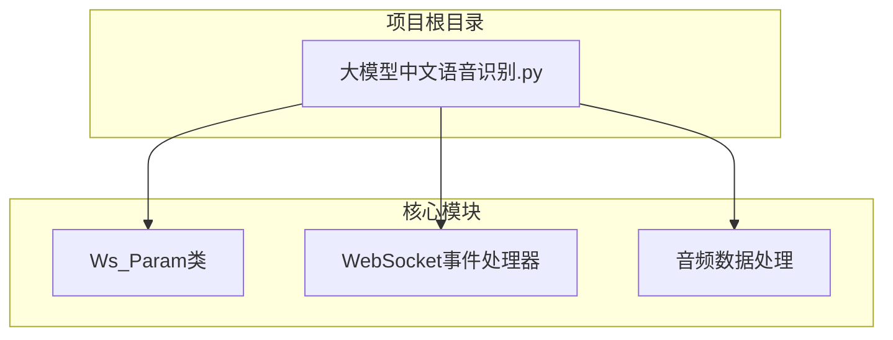
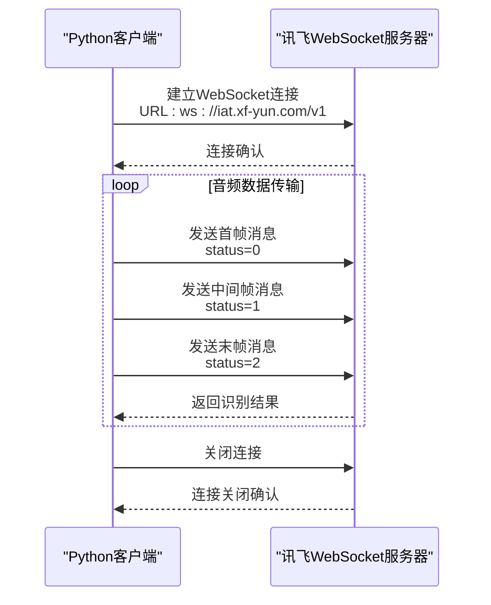
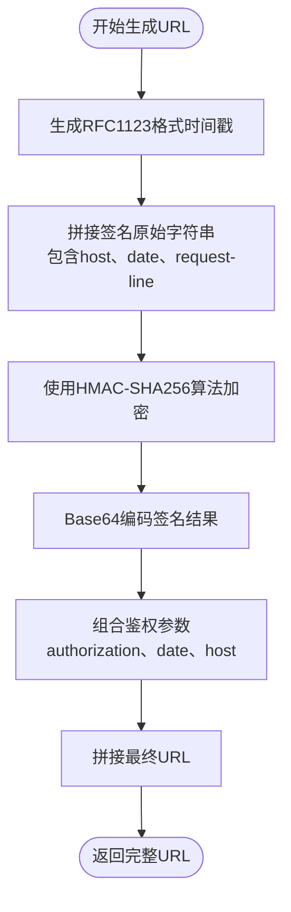
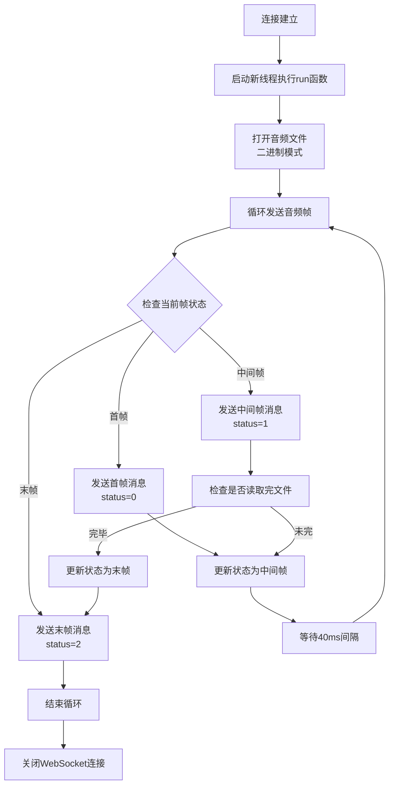
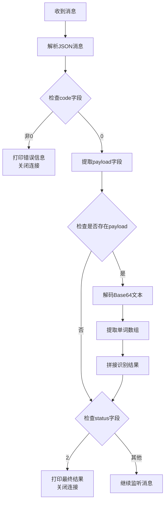
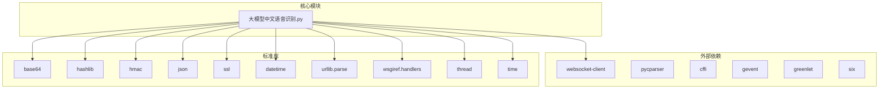

# WebSocket API通信协议

<cite>
**本文档中引用的文件**
- [大模型中文语音识别.py](file://大模型中文语音识别.py)
</cite>

## 目录
1. [简介](#简介)
2. [项目结构](#项目结构)
3. [核心组件](#核心组件)
4. [架构概览](#架构概览)
5. [详细组件分析](#详细组件分析)
6. [依赖关系分析](#依赖关系分析)
7. [性能考虑](#性能考虑)
8. [故障排除指南](#故障排除指南)
9. [结论](#结论)

## 简介

本文档详细描述了讯飞语音识别WebSocket API的通信协议，包括客户端与讯飞服务器`ws://iat.xf-yun.com/v1`的连接建立过程、消息格式规范以及完整的交互流程。该协议支持实时语音转文字功能，采用流式传输方式，通过WebSocket实现高效的数据交换。

## 项目结构

该项目是一个简单的Python脚本，实现了讯飞语音识别的WebSocket客户端。项目结构简洁明了：



**图表来源**
- [大模型中文语音识别.py](file://大模型中文语音识别.py#L1-L212)

**章节来源**
- [大模型中文语音识别.py](file://大模型中文语音识别.py#L1-L212)

## 核心组件

### Ws_Param类
这是整个系统的核心类，负责生成WebSocket连接所需的认证URL和配置参数。

### WebSocket事件处理器
包含四个关键的回调函数：
- `on_open`: 连接建立时触发
- `on_message`: 收到消息时触发
- `on_error`: 发生错误时触发
- `on_close`: 连接关闭时触发

### 音频数据处理
实现了分帧处理音频数据的功能，支持三种帧状态：首帧、中间帧和末帧。

**章节来源**
- [大模型中文语音识别.py](file://大模型中文语音识别.py#L35-L65)
- [大模型中文语音识别.py](file://大模型中文语音识别.py#L90-L137)

## 架构概览

系统采用客户端-服务器架构，通过WebSocket实现实时通信：



**图表来源**
- [大模型中文语音识别.py](file://大模型中文语音识别.py#L139-L210)

## 详细组件分析

### WebSocket连接建立过程

#### 认证URL生成机制



**图表来源**
- [大模型中文语音识别.py](file://大模型中文语音识别.py#L67-L90)

认证URL的生成遵循以下步骤：

1. **时间戳生成**: 使用RFC1123格式的时间戳
2. **签名字符串构建**: 包含主机名、日期和HTTP请求行
3. **HMAC-SHA256加密**: 使用API密钥进行加密
4. **Base64编码**: 对加密结果进行编码
5. **参数组合**: 将鉴权参数组合成查询字符串

#### Ws_Param类实现

```python
class Ws_Param(object):
    def __init__(self, APPID, APIKey, APISecret, AudioFile):
        self.APPID = APPID
        self.APIKey = APIKey
        self.APISecret = APISecret
        self.AudioFile = AudioFile
        self.iat_params = {
            "domain": "slm", 
            "language": "zh_cn", 
            "accent": "mandarin",
            "dwa": "wpgs", 
            "result": {
                "encoding": "utf8",
                "compress": "raw",
                "format": "plain"
            }
        }
```

**章节来源**
- [大模型中文语音识别.py](file://大模型中文语音识别.py#L35-L65)

### 客户端消息格式

#### 首帧消息（status=0）
首帧消息包含完整的配置参数和初始音频数据：

```json
{
    "header": {
        "status": 0,
        "app_id": "your_app_id"
    },
    "parameter": {
        "iat": {
            "domain": "slm",
            "language": "zh_cn",
            "accent": "mandarin",
            "dwa": "wpgs",
            "result": {
                "encoding": "utf8",
                "compress": "raw",
                "format": "plain"
            }
        }
    },
    "payload": {
        "audio": {
            "audio": "base64_encoded_audio_data",
            "sample_rate": 16000,
            "encoding": "raw"
        }
    }
}
```

#### 中间帧消息（status=1）
中间帧仅包含音频数据，不重复发送配置参数：

```json
{
    "header": {
        "status": 1,
        "app_id": "your_app_id"
    },
    "parameter": {
        "iat": {
            "domain": "slm",
            "language": "zh_cn",
            "accent": "mandarin",
            "dwa": "wpgs",
            "result": {
                "encoding": "utf8",
                "compress": "raw",
                "format": "plain"
            }
        }
    },
    "payload": {
        "audio": {
            "audio": "base64_encoded_audio_data",
            "sample_rate": 16000,
            "encoding": "raw"
        }
    }
}
```

#### 末帧消息（status=2）
末帧表示音频数据传输结束：

```json
{
    "header": {
        "status": 2,
        "app_id": "your_app_id"
    },
    "parameter": {
        "iat": {
            "domain": "slm",
            "language": "zh_cn",
            "accent": "mandarin",
            "dwa": "wpgs",
            "result": {
                "encoding": "utf8",
                "compress": "raw",
                "format": "plain"
            }
        }
    },
    "payload": {
        "audio": {
            "audio": "base64_encoded_audio_data",
            "sample_rate": 16000,
            "encoding": "raw"
        }
    }
}
```

**章节来源**
- [大模型中文语音识别.py](file://大模型中文语音识别.py#L139-L185)

### 服务端响应格式

#### 成功响应
当code=0且status=2时，表示识别完成：

```json
{
    "header": {
        "code": 0,
        "message": "success",
        "sid": "session_id",
        "status": 2
    },
    "payload": {
        "result": {
            "bg": 0,
            "ed": 0,
            "fn": "",
            "ls": false,
            "rse": 0,
            "sn": 1,
            "tts": 1,
            "vn": 1,
            "ws": [
                {
                    "bg": 0,
                    "cw": [
                        {
                            "w": "文本内容"
                        }
                    ]
                }
            ]
        }
    }
}
```

#### 错误响应
当code不为0时，表示发生错误：

```json
{
    "header": {
        "code": 10110,
        "message": "认证失败",
        "sid": "session_id",
        "status": 0
    }
}
```

**章节来源**
- [大模型中文语音识别.py](file://大模型中文语音识别.py#L90-L105)

### WebSocket连接生命周期管理

#### on_open事件处理
连接建立后，启动音频数据发送线程：



**图表来源**
- [大模型中文语音识别.py](file://大模型中文语音识别.py#L139-L185)

#### on_message事件处理
收到消息时的处理逻辑：



**图表来源**
- [大模型中文语音识别.py](file://大模型中文语音识别.py#L90-L105)

#### on_error事件处理
错误处理相对简单，仅打印错误信息：

```python
def on_error(ws, error):
    print("### error:", error)
```

#### on_close事件处理
连接关闭时的清理工作：

```python
def on_close(ws, close_status_code, close_msg):
    print("### closed ###")
```

**章节来源**
- [大模型中文语音识别.py](file://大模型中文语音识别.py#L107-L117)

### 常见错误码及解决方案

根据讯飞官方文档，以下是常见错误码及其解决方案：

| 错误码 | 错误信息 | 解决方案 |
|--------|----------|----------|
| 10110 | 认证失败 | 检查APPID、APIKey、APISecret是否正确 |
| 10201 | 参数错误 | 检查音频文件格式、采样率等参数 |
| 10301 | 服务异常 | 稍后重试或联系技术支持 |
| 10302 | 账号余额不足 | 充值或升级账户 |
| 10303 | 请求频率超限 | 降低请求频率 |

**章节来源**
- [大模型中文语音识别.py](file://大模型中文语音识别.py#L21)

## 依赖关系分析

系统的依赖关系清晰明确：



**图表来源**
- [大模型中文语音识别.py](file://大模型中文语音识别.py#L22-L32)

**章节来源**
- [大模型中文语音识别.py](file://大模型中文语音识别.py#L1-L32)

## 性能考虑

### 音频帧大小优化
- 每帧音频大小为1280字节
- 发送间隔为40毫秒，平衡实时性和网络效率

### 内存管理
- 使用二进制模式读取音频文件，避免内存占用过高
- 及时释放不再使用的音频数据

### 并发处理
- 使用多线程处理音频发送和WebSocket事件
- 主线程保持WebSocket连接活跃

## 故障排除指南

### 连接问题
1. **认证失败**: 检查APPID、APIKey、APISecret是否正确
2. **SSL证书错误**: 在`ws.run_forever()`中设置`sslopt={"cert_reqs": ssl.CERT_NONE}`
3. **网络连接问题**: 确保能够访问`ws://iat.xf-yun.com/v1`

### 音频处理问题
1. **音频格式错误**: 确保音频文件为16kHz采样率的PCM格式
2. **文件路径问题**: 检查音频文件路径是否正确
3. **权限问题**: 确保程序有权限读取音频文件

### 性能问题
1. **识别延迟高**: 检查网络状况和服务器负载
2. **内存占用高**: 优化音频缓冲区大小
3. **CPU占用高**: 考虑使用异步处理替代多线程

**章节来源**
- [大模型中文语音识别.py](file://大模型中文语音识别.py#L200-L212)

## 结论

本文档详细描述了讯飞语音识别WebSocket API的通信协议，包括：

1. **认证机制**: 基于HMAC-SHA256的URL签名验证
2. **消息格式**: 分为首帧、中间帧和末帧三种类型
3. **交互流程**: 完整的客户端-服务器通信序列
4. **错误处理**: 常见错误码及解决方案
5. **生命周期管理**: 四个关键事件回调的处理逻辑

该协议设计合理，具有良好的实时性和可靠性，适用于各种语音识别应用场景。开发者可以根据实际需求调整音频参数和处理逻辑，以获得最佳的识别效果。