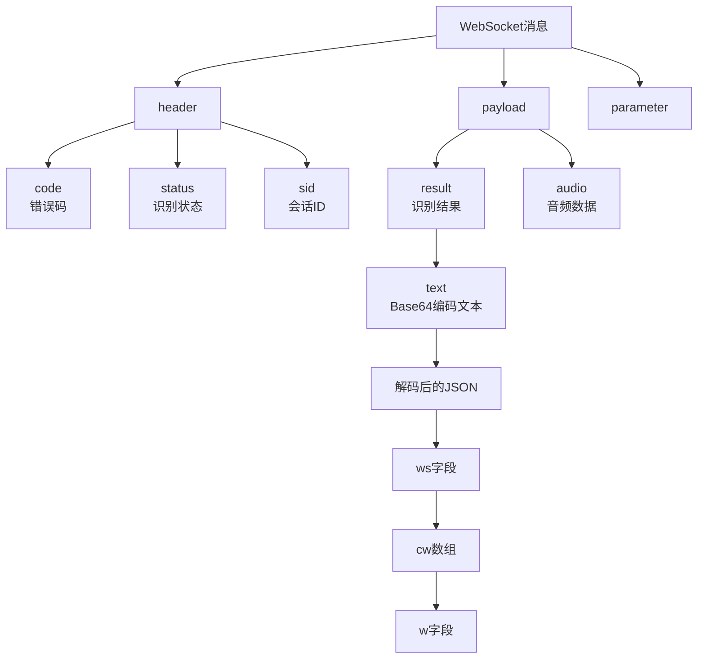
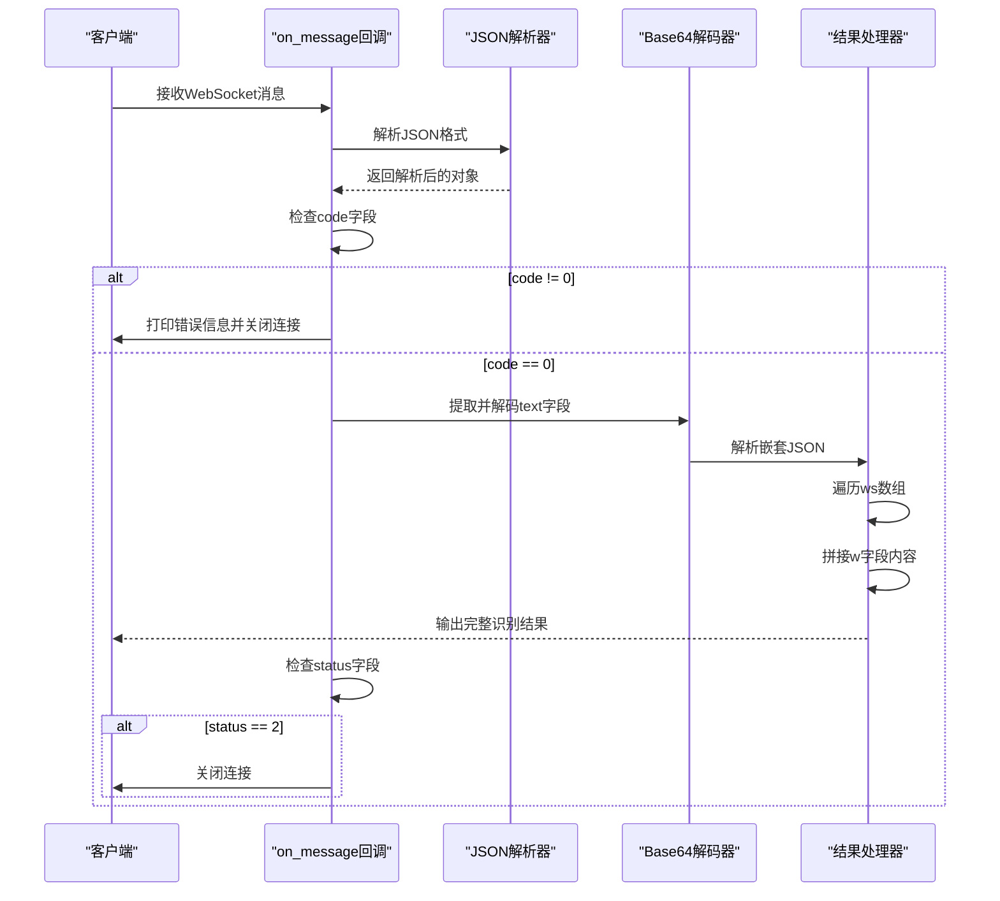
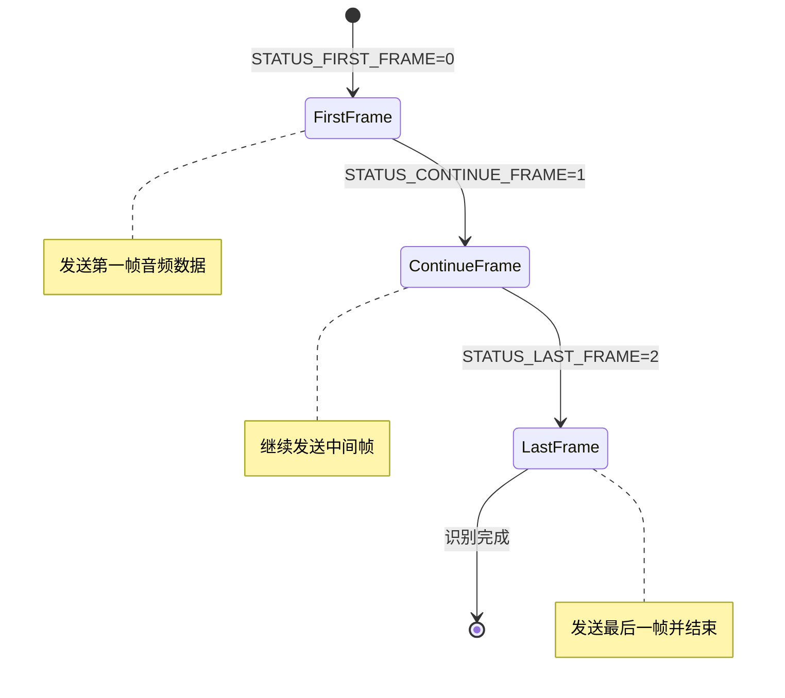
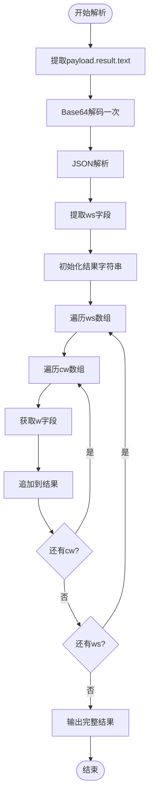
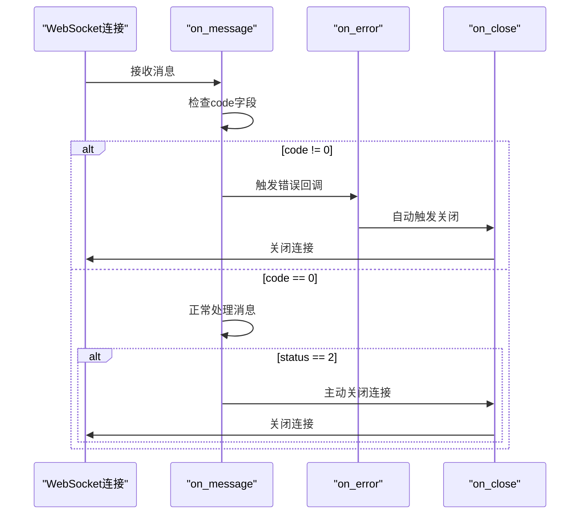

# 服务端响应协议

<cite>
**本文档引用的文件**
- [大模型中文语音识别.py](file://大模型中文语音识别.py)
</cite>

## 目录
1. [简介](#简介)
2. [WebSocket消息结构](#websocket消息结构)
3. [on_message回调函数详解](#on_message回调函数详解)
4. [响应状态处理](#响应状态处理)
5. [结果解析流程](#结果解析流程)
6. [错误处理机制](#错误处理机制)
7. [完整响应示例](#完整响应示例)
8. [性能优化建议](#性能优化建议)
9. [故障排除指南](#故障排除指南)
10. [总结](#总结)

## 简介

本文档详细描述了讯飞语音识别服务的WebSocket通信协议，重点解析服务端返回的消息格式及其处理逻辑。该协议采用JSON格式传输数据，包含header和payload两个主要部分，支持实时语音识别和流式处理。

## WebSocket消息结构

### 基本消息格式

讯飞服务器返回的WebSocket消息遵循标准的JSON格式，包含以下三个核心部分：



**图表来源**
- [大模型中文语音识别.py](file://大模型中文语音识别.py#L90-L137)

### Header部分详解

Header部分包含关键的控制信息：

- **code字段**：表示请求状态，0为成功，非零值参考错误码文档
- **status字段**：表示识别进度，0=第一帧，1=中间帧，2=识别结束
- **sid字段**：会话唯一标识符

### Payload部分详解

Payload部分包含实际的识别结果：

- **result字段**：包含识别结果的文本数据
- **audio字段**：包含音频数据（发送时使用）

**章节来源**
- [大模型中文语音识别.py](file://大模型中文语音识别.py#L90-L137)

## on_message回调函数详解

### 消息接收处理流程



**图表来源**
- [大模型中文语音识别.py](file://大模型中文语音识别.py#L90-L105)

### 核心处理逻辑

on_message函数的核心处理步骤：

1. **JSON解析**：将接收到的字符串消息解析为Python字典对象
2. **状态检查**：验证header.code字段确认请求是否成功
3. **数据提取**：从payload.result.text字段提取Base64编码的文本
4. **多层解码**：先Base64解码，再JSON解析，最后提取ws字段
5. **结果拼接**：遍历ws数组中的cw数组，提取w字段内容并拼接

**章节来源**
- [大模型中文语音识别.py](file://大模型中文语音识别.py#L90-L105)

## 响应状态处理

### 状态码含义



**图表来源**
- [大模型中文语音识别.py](file://大模型中文语音识别.py#L25-L27)

### 状态转换机制

系统通过STATUS_FIRST_FRAME、STATUS_CONTINUE_FRAME和STATUS_LAST_FRAME三个常量来控制音频帧的发送状态：

- **STATUS_FIRST_FRAME (0)**：发送第一帧音频数据，初始化识别会话
- **STATUS_CONTINUE_FRAME (1)**：发送中间帧音频数据，持续进行识别
- **STATUS_LAST_FRAME (2)**：发送最后一帧音频数据，结束识别过程

**章节来源**
- [大模型中文语音识别.py](file://大模型中文语音识别.py#L25-L27)

## 结果解析流程

### Base64解码处理



**图表来源**
- [大模型中文语音识别.py](file://大模型中文语音识别.py#L98-L105)

### 编码处理细节

结果解析过程中的编码处理需要特别注意：

1. **第一层解码**：从Base64编码的字符串解码为原始JSON字符串
2. **第二层解析**：将JSON字符串解析为Python字典对象
3. **字段提取**：访问ws字段获取词段数组
4. **字符拼接**：遍历cw数组，提取w字段内容并按顺序拼接

这种两层解码机制确保了中文字符不会出现乱码问题。

**章节来源**
- [大模型中文语音识别.py](file://大模型中文语音识别.py#L98-L105)

## 错误处理机制

### 常见错误码

根据项目中的错误码链接，常见的错误码包括：

- **400**：参数错误，检查请求参数的正确性
- **401**：认证失败，确认APPID、APIKey和APISecret的有效性
- **403**：权限不足，检查应用是否有语音识别权限
- **408**：请求超时，网络连接可能存在问题
- **500**：服务器内部错误，可能是服务暂时不可用

### 异常处理流程



**图表来源**
- [大模型中文语音识别.py](file://大模型中文语音识别.py#L90-L105)

### 回调函数功能

- **on_error**：处理WebSocket连接错误，打印错误信息
- **on_close**：处理连接关闭事件，打印关闭状态
- **自动关闭机制**：当code不为0或status为2时自动关闭连接

**章节来源**
- [大模型中文语音识别.py](file://大模型中文语音识别.py#L107-L115)

## 完整响应示例

### 典型响应结构

以下是典型的讯飞服务器响应示例：

```json
{
    "header": {
        "code": 0,
        "status": 1,
        "sid": "cva1234567890abcdef"
    },
    "parameter": {
        "iat": {
            "domain": "slm",
            "language": "zh_cn",
            "accent": "mandarin",
            "dwa": "wpgs",
            "result": {
                "encoding": "utf8",
                "compress": "raw",
                "format": "plain"
            }
        }
    },
    "payload": {
        "result": {
            "text": "eyJ3cyI6W3siY3ciOlt7InciOiJIZWxsbyJ9LHsiVyI6IldvcmxkIn1dfV19"
        }
    }
}
```

### 响应解析过程

1. **Base64解码**：将text字段解码为JSON字符串
2. **JSON解析**：解析为Python字典
3. **提取ws字段**：获取词段数组
4. **遍历处理**：提取每个词段的w字段
5. **结果拼接**：将所有词段按顺序拼接成完整文本

**章节来源**
- [大模型中文语音识别.py](file://大模型中文语音识别.py#L98-L105)

## 性能优化建议

### 连接管理

- **自动关闭机制**：当识别完成后自动关闭连接，避免资源浪费
- **错误快速处理**：遇到错误码立即关闭连接，减少无效等待
- **状态机设计**：清晰的状态转换确保音频帧发送的正确性

### 内存优化

- **流式处理**：逐帧读取音频文件，避免大文件占用过多内存
- **及时释放**：处理完每帧数据后及时释放内存
- **编码处理**：正确的编码解码避免内存泄漏

## 故障排除指南

### 常见问题及解决方案

1. **认证失败 (401)**
   - 检查APPID、APIKey和APISecret是否正确
   - 确认应用具有语音识别权限
   - 验证时间戳和签名生成是否正确

2. **中文乱码问题**
   - 确保使用正确的编码解码流程
   - 检查Base64解码和JSON解析的顺序
   - 验证UTF-8编码设置

3. **连接超时**
   - 检查网络连接稳定性
   - 调整超时参数设置
   - 确认防火墙设置

4. **音频格式问题**
   - 确认音频采样率为16kHz
   - 检查音频编码格式为raw
   - 验证音频文件完整性

### 调试技巧

- 启用trace模式查看详细的WebSocket通信过程
- 打印生成的URL和鉴权参数进行对比验证
- 使用日志记录关键处理节点的状态信息

**章节来源**
- [大模型中文语音识别.py](file://大模型中文语音识别.py#L21)

## 总结

讯飞语音识别服务的WebSocket协议提供了高效、可靠的语音识别解决方案。通过理解其消息格式、状态管理和错误处理机制，开发者可以构建稳定可靠的语音识别应用。

关键要点：
- 消息采用JSON格式，包含header、parameter和payload三个部分
- header.code字段用于状态检查，status字段指示识别进度
- 结果文本需要经过两层Base64解码才能获得正确内容
- 系统提供完善的错误处理和自动关闭机制
- 正确的编码处理是避免中文乱码的关键

通过遵循本文档的指导原则和最佳实践，开发者可以充分利用讯飞语音识别服务的强大功能，构建高质量的语音识别应用。