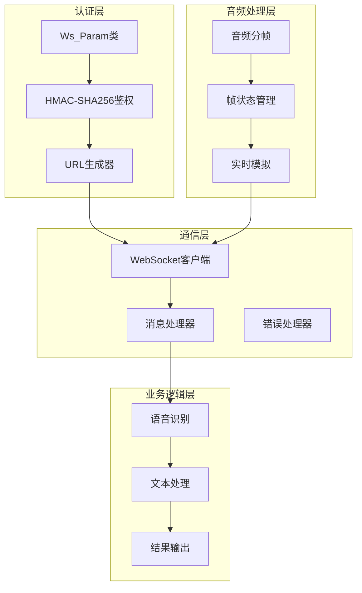
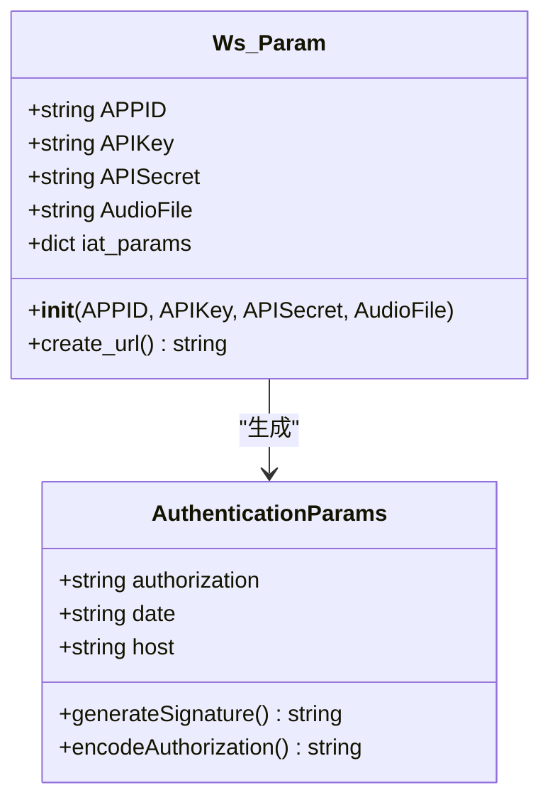
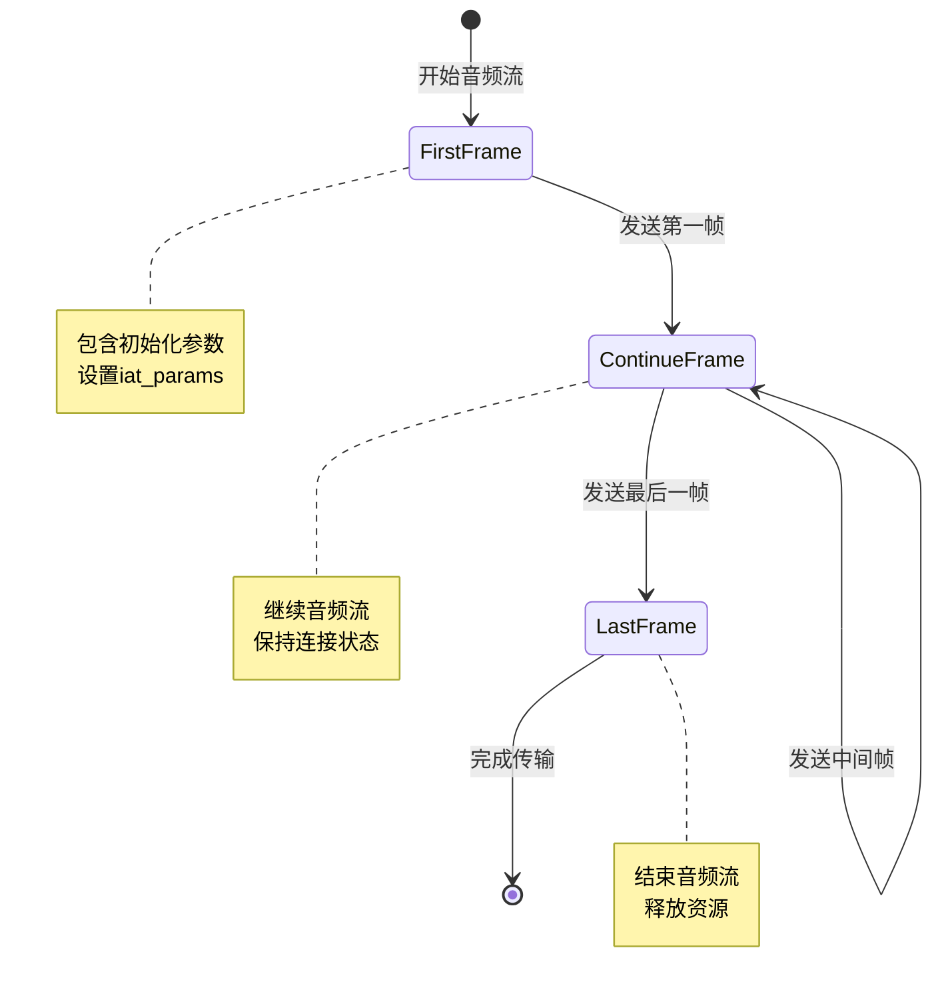
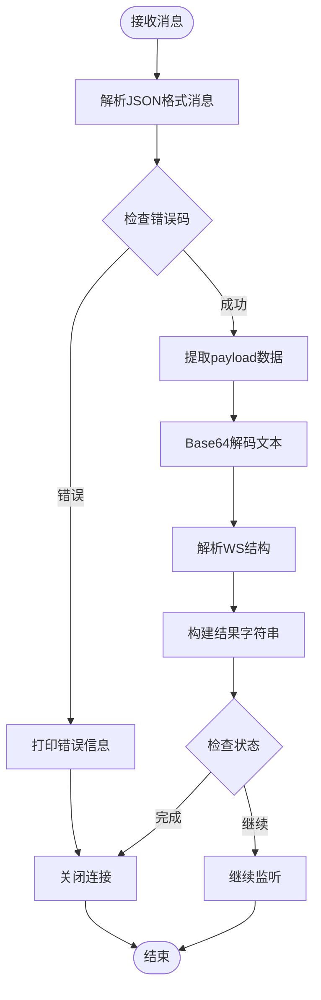
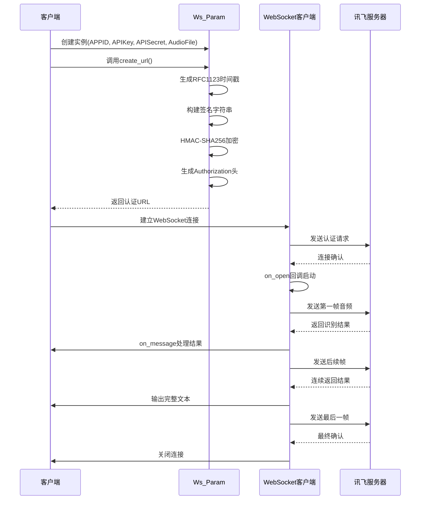
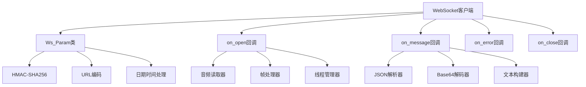

# 核心功能详解

<cite>
**本文档中引用的文件**
- [大模型中文语音识别.py](file://大模型中文语音识别.py)
</cite>

## 目录
1. [简介](#简介)
2. [项目架构概览](#项目架构概览)
3. [Ws_Param类设计与HMAC-SHA256鉴权机制](#ws_param类设计与hmac-sha256鉴权机制)
4. [音频处理流程详解](#音频处理流程详解)
5. [WebSocket消息处理机制](#websocket消息处理机制)
6. [核心组件交互分析](#核心组件交互分析)
7. [性能优化与最佳实践](#性能优化与最佳实践)
8. [故障排除指南](#故障排除指南)
9. [总结](#总结)

## 简介

本文档深入分析了一个基于讯飞语音识别API的Python语音识别系统的核心功能模块。该系统实现了完整的语音识别流程，包括HMAC-SHA256鉴权机制、音频分帧处理、WebSocket通信以及实时语音转文字等功能。通过详细的技术分析，我们将揭示每个核心组件的设计原理和实现细节。

## 项目架构概览

该项目采用模块化设计，主要包含以下核心组件：



**图表来源**
- [大模型中文语音识别.py](file://大模型中文语音识别.py#L21-L90)

## Ws_Param类设计与HMAC-SHA256鉴权机制

### 类设计概述

`Ws_Param`类是整个系统的核心认证组件，负责生成符合讯飞API要求的WebSocket连接URL。该类封装了所有必要的认证参数和生成逻辑。



**图表来源**
- [大模型中文语音识别.py](file://大模型中文语音识别.py#L40-L90)

### HMAC-SHA256鉴权机制详解

#### RFC1123时间戳生成

系统首先生成符合RFC1123标准的时间戳：

```python
now = datetime.now()
date = format_date_time(mktime(now.timetuple()))
```

这确保了时间格式符合HTTP协议规范，便于服务器验证请求时效性。

#### 签名字符串拼接

签名字符串按照特定格式构建：
```
host: iat.xf-yun.com
date: [RFC1123格式时间]
GET /v1 HTTP/1.1
```

这种结构化的签名字符串包含了请求的关键元信息，确保了请求的完整性和不可篡改性。

#### HMAC-SHA256加密过程

```python
signature_sha = hmac.new(
    self.APISecret.encode('utf-8'), 
    signature_origin.encode('utf-8'),
    digestmod=hashlib.sha256
).digest()
```

这里使用API密钥作为密钥材料，对签名字符串进行HMAC-SHA256加密，生成256位的数字签名。

#### Authorization头构造

最终的Authorization头按照以下格式构造：

```python
authorization_origin = "api_key=\"%s\", algorithm=\"%s\", headers=\"%s\", signature=\"%s\"" % (
    self.APIKey, "hmac-sha256", "host date request-line", signature_sha)
```

这个格式化的字符串包含了API密钥、算法类型、请求头字段列表和数字签名，构成了完整的认证凭据。

**章节来源**
- [大模型中文语音识别.py](file://大模型中文语音识别.py#L63-L89)

## 音频处理流程详解

### 音频分帧设计原理

系统采用1280字节的固定帧大小进行音频分帧处理，这是经过优化的选择：

```python
frameSize = 1280  # 每一帧的音频大小
intervel = 0.04  # 发送音频间隔(单位:s)
```

这种设计考虑了以下因素：
- **网络传输效率**：适中的帧大小平衡了传输开销和实时性
- **内存占用**：避免过大的缓冲区导致内存压力
- **实时性要求**：40ms的间隔接近语音识别的最佳采样频率

### 帧状态管理机制

系统定义了三种关键状态来管理音频流：

```python
STATUS_FIRST_FRAME = 0      # 第一帧标识
STATUS_CONTINUE_FRAME = 1   # 中间帧标识  
STATUS_LAST_FRAME = 2       # 最后一帧标识
```

这些状态标识在流式传输中具有重要意义：



**图表来源**
- [大模型中文语音识别.py](file://大模型中文语音识别.py#L134-L170)

### 实时音频流模拟

系统通过`time.sleep(intervel)`模拟真实的音频采样间隔：

```python
# 模拟音频采样间隔
time.sleep(intervel)
```

这种设计确保了音频数据的发送节奏与实际语音采集同步，提高了识别准确率。

**章节来源**
- [大模型中文语音识别.py](file://大模型中文语音识别.py#L134-L170)

## WebSocket消息处理机制

### on_message回调函数解析

`on_message`函数负责处理来自服务端的响应消息：



**图表来源**
- [大模型中文语音识别.py](file://大模型中文语音识别.py#L92-L110)

### JSON数据解析流程

消息解析遵循以下步骤：

1. **基础信息提取**：
```python
message = json.loads(message)
code = message["header"]["code"]
status = message["header"]["status"]
```

2. **错误处理**：
```python
if code != 0:
    print(f"请求错误：{code}")
    ws.close()
```

3. **文本数据处理**：
```python
text = payload["result"]["text"]
text = json.loads(str(base64.b64decode(text), "utf8"))
text_ws = text['ws']
```

4. **结果拼接**：
```python
result = ''
for i in text_ws:
    for j in i["cw"]:
        w = j["w"]
        result += w
print(result)
```

### 多帧数据合并机制

系统能够正确处理多帧返回的数据，通过遍历`ws`数组中的每个元素，逐个提取单词并拼接成完整的句子。

**章节来源**
- [大模型中文语音识别.py](file://大模型中文语音识别.py#L92-L110)

## 核心组件交互分析

### 整体数据流图



**图表来源**
- [大模型中文语音识别.py](file://大模型中文语音识别.py#L40-L211)

### 组件依赖关系

系统的组件间存在清晰的依赖关系：



**图表来源**
- [大模型中文语音识别.py](file://大模型中文语音识别.py#L21-L211)

## 性能优化与最佳实践

### 内存管理策略

系统采用了高效的内存管理策略：

1. **流式读取**：使用`with open()`确保文件句柄正确关闭
2. **按需加载**：音频数据按帧读取，避免一次性加载整个文件
3. **及时释放**：连接完成后立即关闭，释放网络资源

### 并发处理机制

通过`_thread`模块实现并发处理：

```python
thread.start_new_thread(run, ())
```

这种方式允许音频数据的发送和WebSocket消息的接收并行处理，提高了整体性能。

### 错误恢复机制

系统具备完善的错误处理能力：

```python
def on_error(ws, error):
    print("### error:", error)

def on_close(ws, close_status_code, close_msg):
    print("### closed ###")
```

这些回调函数确保了即使发生异常也能优雅地处理和清理资源。

## 故障排除指南

### 常见问题诊断

1. **认证失败**：
   - 检查APPID、APIKey、APISecret是否正确
   - 验证时间戳是否在有效期内
   - 确认签名计算过程无误

2. **音频传输问题**：
   - 确认音频文件格式符合要求（16kHz采样率，PCM编码）
   - 检查帧大小设置是否合理
   - 验证网络连接稳定性

3. **识别结果异常**：
   - 检查语言参数设置
   - 确认方言配置正确
   - 验证热词设置是否生效

### 调试技巧

系统提供了调试支持：

```python
# 启用调试模式
websocket.enableTrace(True)
```

可以通过取消注释相关打印语句来获取详细的调试信息。

**章节来源**
- [大模型中文语音识别.py](file://大模型中文语音识别.py#L200-L211)

## 总结

本文档详细分析了基于讯飞语音识别API的Python系统的四个核心功能模块：

1. **HMAC-SHA256鉴权机制**：通过RFC1123时间戳、签名字符串拼接和Authorization头构造，实现了安全可靠的API访问控制。

2. **音频分帧处理**：采用1280字节的帧大小和三种状态标识，构建了高效的流式音频传输机制。

3. **WebSocket消息处理**：实现了完整的双向通信协议，支持实时音频传输和结果反馈。

4. **多线程并发处理**：通过独立线程处理音频发送，确保了系统的响应性和稳定性。

这些核心功能的有机结合，使得整个系统能够高效、稳定地完成语音识别任务，为用户提供优质的语音转文字服务体验。