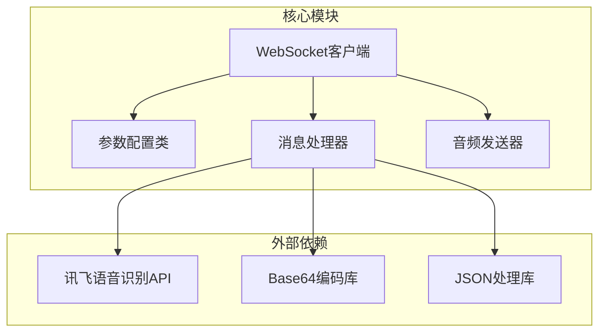
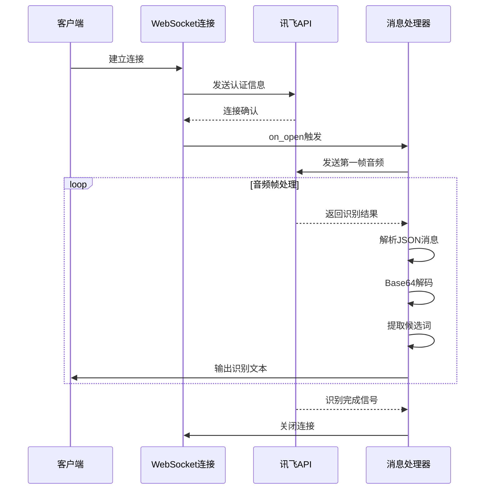
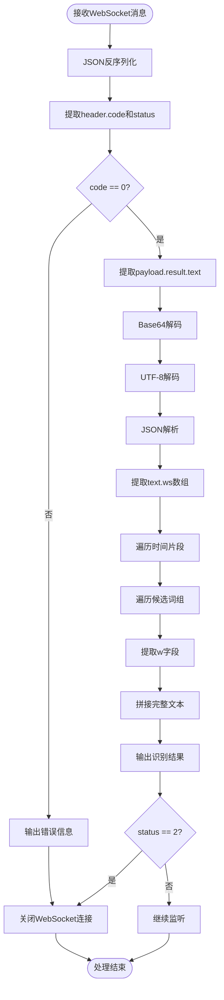
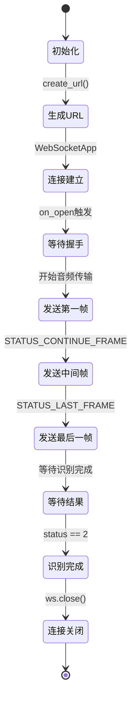
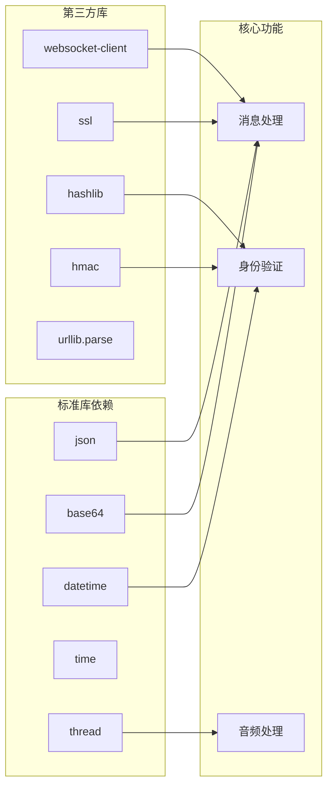

# 识别结果解析

<cite>
**本文档引用的文件**
- [大模型中文语音识别.py](file://大模型中文语音识别.py)
</cite>

## 目录
1. [简介](#简介)
2. [项目结构](#项目结构)
3. [核心组件](#核心组件)
4. [架构概览](#架构概览)
5. [详细组件分析](#详细组件分析)
6. [依赖关系分析](#依赖关系分析)
7. [性能考虑](#性能考虑)
8. [故障排除指南](#故障排除指南)
9. [结论](#结论)

## 简介

本文档全面解析了基于讯飞语音识别API的WebSocket消息处理流程，重点关注`on_message`回调函数对服务端返回数据的处理机制。该系统通过WebSocket协议接收实时语音识别结果，经过多层解码和结构化处理，最终输出可读的文本内容。

## 项目结构

该项目采用简洁的单文件架构，主要包含以下核心模块：



**图表来源**
- [大模型中文语音识别.py](file://大模型中文语音识别.py#L1-L212)

**章节来源**
- [大模型中文语音识别.py](file://大模型中文语音识别.py#L1-L212)

## 核心组件

### WebSocket消息处理核心逻辑

系统的核心在于`on_message`回调函数，它负责处理来自讯飞语音识别API的WebSocket消息。该函数实现了完整的错误处理、数据解码和文本提取流程。

### 参数配置类（Ws_Param）

`Ws_Param`类封装了WebSocket连接所需的所有参数，包括：
- 应用ID（APPID）
- API密钥（APIKey）
- 密钥签名（APISecret）
- 音频文件路径
- 识别参数配置

**章节来源**
- [大模型中文语音识别.py](file://大模型中文语音识别.py#L48-L90)

## 架构概览

系统采用事件驱动的WebSocket架构，通过状态机模式管理音频帧传输和识别结果处理：



**图表来源**
- [大模型中文语音识别.py](file://大模型中文语音识别.py#L92-L110)
- [大模型中文语音识别.py](file://大模型中文语音识别.py#L112-L180)

## 详细组件分析

### on_message回调函数深度解析

`on_message`函数是整个系统的核心处理逻辑，负责接收和处理WebSocket消息：

```python
def on_message(ws, message):
    message = json.loads(message)
    code = message["header"]["code"]
    status = message["header"]["status"]
    if code != 0:
        print(f"请求错误：{code}")
        ws.close()
    else:
        payload = message.get("payload")
        if payload:
            text = payload["result"]["text"]
            text = json.loads(str(base64.b64decode(text), "utf8"))
            text_ws = text['ws']
            result = ''
            for i in text_ws:
                for j in i["cw"]:
                    w = j["w"]
                    result += w
            print(result)
        if status == 2:
            ws.close()
```

#### 消息解析流程

1. **JSON反序列化**：使用`json.loads()`将接收到的WebSocket消息字符串转换为Python字典对象
2. **状态检查**：提取`header.code`和`header.status`字段
   - `code`为非零值表示请求失败，系统输出错误信息并关闭连接
   - `code`为0表示请求成功，继续处理有效负载
3. **有效负载提取**：从`payload.result.text`字段获取Base64编码的识别结果

#### 双重解码过程详解



**图表来源**
- [大模型中文语音识别.py](file://大模型中文语音识别.py#L92-L110)

#### text['ws']数组结构深度分析

`text['ws']`是一个嵌套的数据结构，包含多个时间片段（i），每个片段下又包含候选词组（cw）：

```python
# 典型的text['ws']结构示例
{
    "ws": [
        {
            "bg": 0,  # 起始时间戳
            "cw": [
                {
                    "sc": 0.95,  # 置信度分数
                    "w": "你好"  # 候选词
                },
                {
                    "sc": 0.85,
                    "w": "您好"
                }
            ]
        },
        {
            "bg": 1000,  # 起始时间戳（毫秒）
            "cw": [
                {
                    "sc": 0.98,
                    "w": "世界"
                }
            ]
        }
    ]
}
```

#### 文本提取算法实现

系统通过两层循环遍历整个数据结构，提取所有候选词的`w`字段并拼接成完整文本：

```python
result = ''
for i in text_ws:           # 遍历时间片段
    for j in i["cw"]:       # 遍历候选词组
        w = j["w"]          # 获取候选词
        result += w         # 拼接到结果字符串
```

这种设计允许系统处理实时语音识别中的不确定性，通过置信度分数选择最可能的候选词。

### WebSocket连接管理

#### 连接建立阶段



**图表来源**
- [大模型中文语音识别.py](file://大模型中文语音识别.py#L112-L180)

#### 音频帧状态管理

系统使用三个状态常量来管理音频帧的发送过程：

- `STATUS_FIRST_FRAME (0)`：第一帧音频，包含完整的识别参数
- `STATUS_CONTINUE_FRAME (1)`：中间帧音频，仅包含音频数据
- `STATUS_LAST_FRAME (2)`：最后一帧音频，标记识别结束

**章节来源**
- [大模型中文语音识别.py](file://大模型中文语音识别.py#L92-L110)
- [大模型中文语音识别.py](file://大模型中文语音识别.py#L112-L180)

## 依赖关系分析

系统的依赖关系相对简单，主要依赖于标准库和第三方WebSocket库：



**图表来源**
- [大模型中文语音识别.py](file://大模型中文语音识别.py#L1-L30)

**章节来源**
- [大模型中文语音识别.py](file://大模型中文语音识别.py#L1-L30)

## 性能考虑

### 内存使用优化

1. **流式处理**：音频文件以1280字节的固定帧大小读取，避免一次性加载整个文件到内存
2. **及时释放**：每处理完一帧音频后立即释放内存，保持低内存占用
3. **连接复用**：WebSocket连接在整个识别过程中保持打开状态，减少连接开销

### 网络传输优化

1. **Base64编码**：音频数据采用Base64编码传输，确保二进制数据的可靠传输
2. **分帧传输**：将长音频分割为多个小帧，支持实时处理和网络中断恢复
3. **状态同步**：通过status字段精确控制帧传输顺序和识别流程

## 故障排除指南

### 常见错误及解决方案

#### 1. 认证失败（code != 0）

**问题症状**：程序输出"请求错误：xxx"并立即关闭连接

**可能原因**：
- APPID、APIKey或APISecret配置错误
- 时间戳计算不准确
- 签名算法实现错误

**解决方案**：
- 检查讯飞开放平台的应用配置
- 验证时间格式是否符合RFC1123规范
- 确认HMAC-SHA256签名计算正确

#### 2. Base64解码失败

**问题症状**：JSON解析异常或Unicode解码错误

**可能原因**：
- 服务端返回的Base64数据损坏
- 编码格式不匹配
- 数据传输过程中被截断

**解决方案**：
- 检查网络连接稳定性
- 验证音频文件格式和编码
- 添加数据完整性校验

#### 3. WebSocket连接超时

**问题症状**：连接建立后无响应或频繁断线

**可能原因**：
- 网络防火墙阻止WebSocket连接
- 服务器端限制连接频率
- 客户端SSL证书验证失败

**解决方案**：
- 配置适当的防火墙规则
- 实现连接重试机制
- 使用正确的SSL配置

**章节来源**
- [大模型中文语音识别.py](file://大模型中文语音识别.py#L92-L110)

## 结论

本文档详细分析了基于讯飞语音识别API的WebSocket消息处理系统，重点阐述了`on_message`回调函数对服务端返回数据的完整处理流程。系统通过精心设计的双重解码机制和层次化的数据结构处理，实现了高效可靠的语音识别结果提取。

关键特性包括：
- **健壮的错误处理**：通过code字段检测请求状态，及时处理异常情况
- **高效的文本提取**：通过遍历嵌套的候选词结构，构建完整的识别文本
- **优雅的连接管理**：根据status字段自动控制连接生命周期
- **简洁的架构设计**：模块化的设计便于维护和扩展

该系统为开发者提供了完整的语音识别集成方案，适用于各种需要实时语音转文字的应用场景。