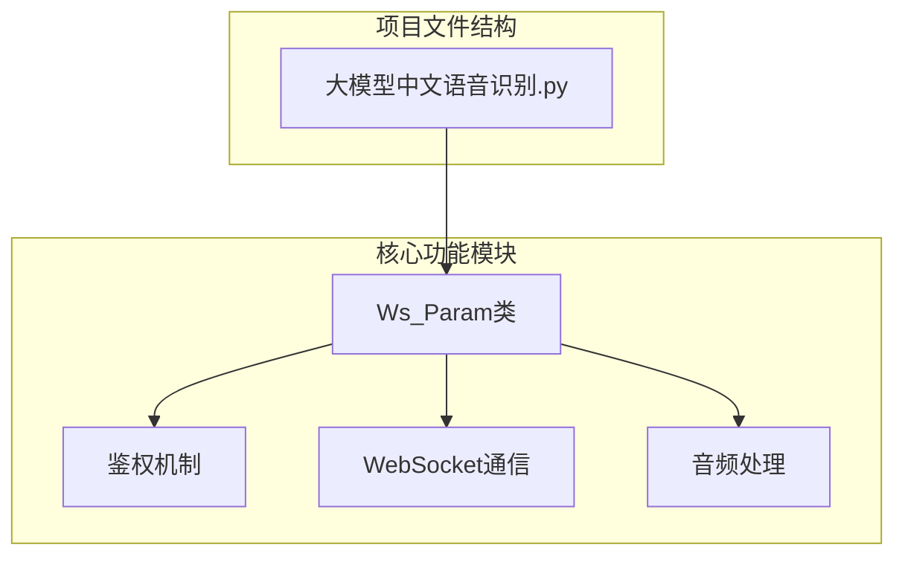
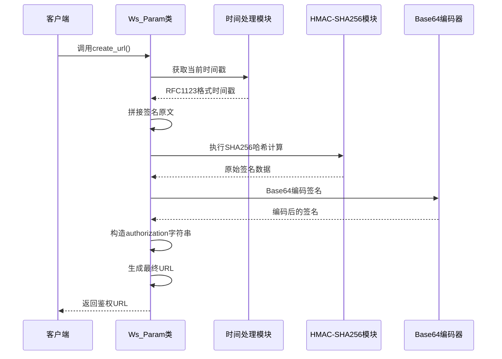
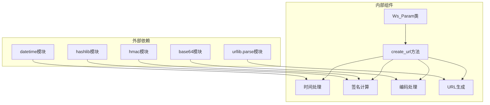

# 讯飞API WebSocket鉴权机制详解

<cite>
**本文档引用的文件**
- [大模型中文语音识别.py](file://大模型中文语音识别.py)
</cite>

## 目录
1. [简介](#简介)
2. [项目结构概览](#项目结构概览)
3. [核心组件分析](#核心组件分析)
4. [架构概览](#架构概览)
5. [详细组件分析](#详细组件分析)
6. [依赖关系分析](#依赖关系分析)
7. [性能考虑](#性能考虑)
8. [故障排除指南](#故障排除指南)
9. [结论](#结论)

## 简介

本文档深入分析了讯飞API WebSocket接口的HMAC-SHA256鉴权机制，重点解析Ws_Param类中create_url方法的实现细节。该机制通过RFC1123格式时间戳、签名原文字符串拼接、HMAC-SHA256哈希计算和Base64编码等步骤，确保API调用的安全性。

## 项目结构概览

该项目是一个基于Python的语音识别客户端，主要包含以下核心文件：



**图表来源**
- [大模型中文语音识别.py](file://大模型中文语音识别.py#L1-L212)

**章节来源**
- [大模型中文语音识别.py](file://大模型中文语音识别.py#L1-L212)

## 核心组件分析

### Ws_Param类设计

Ws_Param类是整个鉴权系统的核心，负责管理API密钥、应用信息和生成鉴权URL：

```python
class Ws_Param(object):
    def __init__(self, APPID, APIKey, APISecret, AudioFile):
        self.APPID = APPID
        self.APIKey = APIKey
        self.APISecret = APISecret
        self.AudioFile = AudioFile
        self.iat_params = {
            "domain": "slm", "language": "zh_cn", "accent": "mandarin",
            "dwa": "wpgs", "result": {
                "encoding": "utf8",
                "compress": "raw",
                "format": "plain"
            }
        }
```

该类的设计遵循面向对象原则，将API密钥管理、参数配置和URL生成封装在一个统一的接口中。

**章节来源**
- [大模型中文语音识别.py](file://大模型中文语音识别.py#L44-L58)

## 架构概览

整个鉴权系统采用分层架构设计，从底层的加密算法到高层的URL生成，形成了完整的安全链路：



**图表来源**
- [大模型中文语音识别.py](file://大模型中文语音识别.py#L63-L89)

## 详细组件分析

### RFC1123时间戳生成机制

时间戳生成是鉴权流程的第一步，使用了Python标准库中的format_date_time和mktime函数：

```python
now = datetime.now()
date = format_date_time(mktime(now.timetuple()))
```

这个组合使用方式确保了：
1. **时间准确性**：使用当前系统时间
2. **格式标准化**：符合RFC1123规范的HTTP日期格式
3. **兼容性保证**：与HTTP协议标准保持一致

RFC1123格式的时间戳示例：`Tue, 15 Aug 2023 14:30:00 GMT`

### 签名原文字符串构建

签名原文字符串是HMAC-SHA256计算的基础，按照特定格式拼接：

```python
signature_origin = "host: " + "iat.xf-yun.com" + "\n"
signature_origin += "date: " + date + "\n"
signature_origin += "GET " + "/v1 " + "HTTP/1.1"
```

这种三部分结构的设计具有重要意义：
- **Host头**：指定目标服务器域名
- **Date头**：包含RFC1123格式的时间戳
- **Request-Line**：HTTP GET请求的基本信息

### HMAC-SHA256签名计算

这是鉴权流程的核心安全机制：

```python
signature_sha = hmac.new(
    self.APISecret.encode('utf-8'), 
    signature_origin.encode('utf-8'),
    digestmod=hashlib.sha256
).digest()
```

关键特性：
1. **密钥保护**：使用APISecret作为HMAC密钥
2. **算法强度**：采用SHA256哈希算法
3. **数据完整性**：确保签名与原始数据的一致性

### Base64编码处理

签名计算完成后，需要进行Base64编码以便在网络传输中安全传递：

```python
signature_sha = base64.b64encode(signature_sha).decode(encoding='utf-8')
```

这一步确保了：
- **字符集兼容性**：所有字符都能安全传输
- **长度标准化**：编码后的字符串长度固定
- **URL安全**：避免特殊字符导致的解析问题

### Authorization字符串构造

最终的Authorization字符串包含了四个关键字段：

```python
authorization_origin = "api_key=\"%s\", algorithm=\"%s\", headers=\"%s\", signature=\"%s\"" % (
    self.APIKey, "hmac-sha256", "host date request-line", signature_sha)
```

各字段含义：
- **api_key**：API访问密钥，用于身份识别
- **algorithm**：使用的加密算法，明确安全标准
- **headers**：参与签名的HTTP头部字段列表
- **signature**：经过Base64编码的HMAC-SHA256签名

### URL参数拼接

最后，将鉴权参数组合成查询字符串：

```python
v = {
    "authorization": authorization,
    "date": date,
    "host": "iat.xf-yun.com"
}
url = url + '?' + urlencode(v)
```

这种方式的优势：
- **参数分离**：清晰区分不同类型的鉴权参数
- **扩展性强**：便于未来添加新的鉴权选项
- **标准兼容**：符合HTTP协议规范

**章节来源**
- [大模型中文语音识别.py](file://大模型中文语音识别.py#L63-L89)

## 依赖关系分析

整个鉴权系统的依赖关系体现了模块化设计的优势：



**图表来源**
- [大模型中文语音识别.py](file://大模型中文语音识别.py#L21-L38)

**章节来源**
- [大模型中文语音识别.py](file://大模型中文语音识别.py#L21-L38)

## 性能考虑

### 时间戳生成效率

使用`datetime.now()`配合`format_date_time(mktime())`的方式：
- **时间复杂度**：O(1)，常数时间操作
- **空间复杂度**：O(1)，不产生额外内存开销
- **精度保证**：毫秒级时间精度

### HMAC计算优化

HMAC-SHA256计算的特点：
- **CPU友好**：现代处理器对SHA256有硬件加速支持
- **内存效率**：只在内存中临时存储计算结果
- **并发安全**：无状态设计，支持多线程并发

### Base64编码性能

Base64编码的性能特征：
- **快速编码**：Python内置的高效实现
- **缓冲区管理**：自动处理大文件的分块编码
- **内存映射**：支持大文件的内存映射编码

## 故障排除指南

### 常见错误及解决方案

1. **时间同步问题**
   - 症状：认证失败，提示时间过期
   - 解决方案：确保客户端系统时间准确，与NTP服务器同步

2. **编码格式错误**
   - 症状：Base64解码失败
   - 解决方案：确认所有字符串都使用UTF-8编码

3. **签名验证失败**
   - 症状：API返回签名错误
   - 解决方案：检查APISecret是否正确，确保签名原文格式无误

### 调试技巧

启用调试输出可以更好地理解鉴权过程：

```python
# 在create_url方法中添加调试信息
print("生成的时间戳:", date)
print("签名原文:", signature_origin)
print("最终URL:", url)
```

**章节来源**
- [大模型中文语音识别.py](file://大模型中文语音识别.py#L85-L89)

## 结论

讯飞API的WebSocket鉴权机制通过精心设计的多层安全防护，确保了API调用的安全性和可靠性。该机制的主要优势包括：

1. **安全性强**：采用HMAC-SHA256算法，提供强大的数据完整性保护
2. **标准兼容**：完全符合HTTP认证标准和RFC规范
3. **易于实现**：清晰的代码结构和标准的Python库支持
4. **性能优异**：高效的算法实现和优化的编码处理

通过深入理解这个鉴权机制，开发者可以更好地掌握API安全原理，为构建安全可靠的网络应用提供重要参考。该机制不仅适用于讯飞API，也为其他类似场景的鉴权设计提供了优秀的范例。