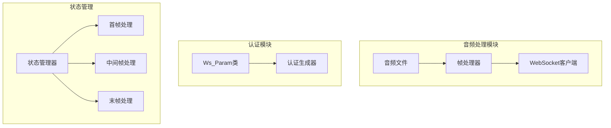
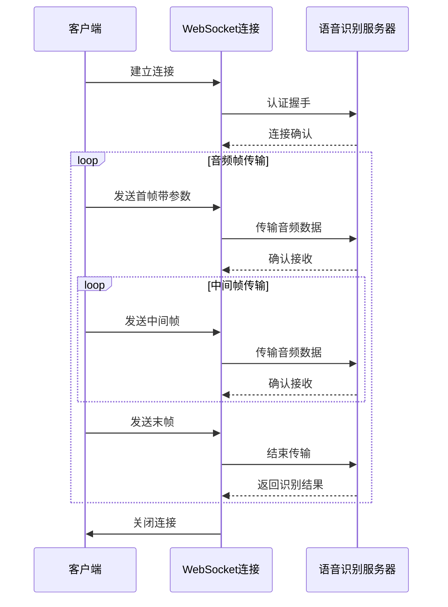
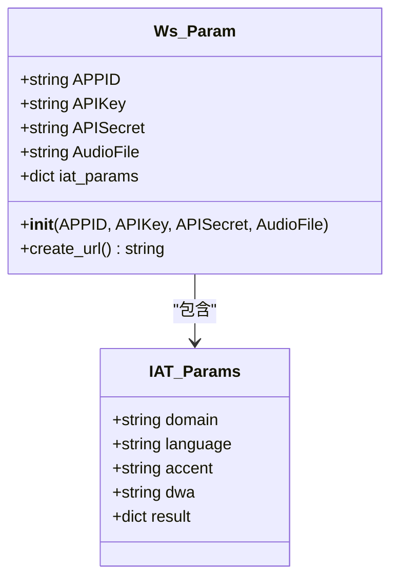
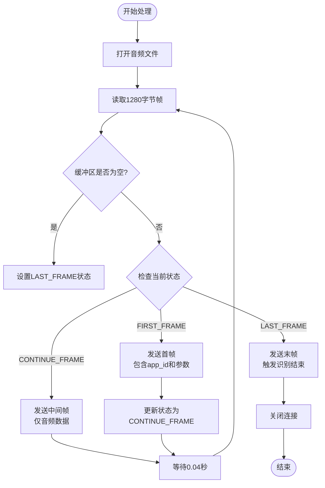
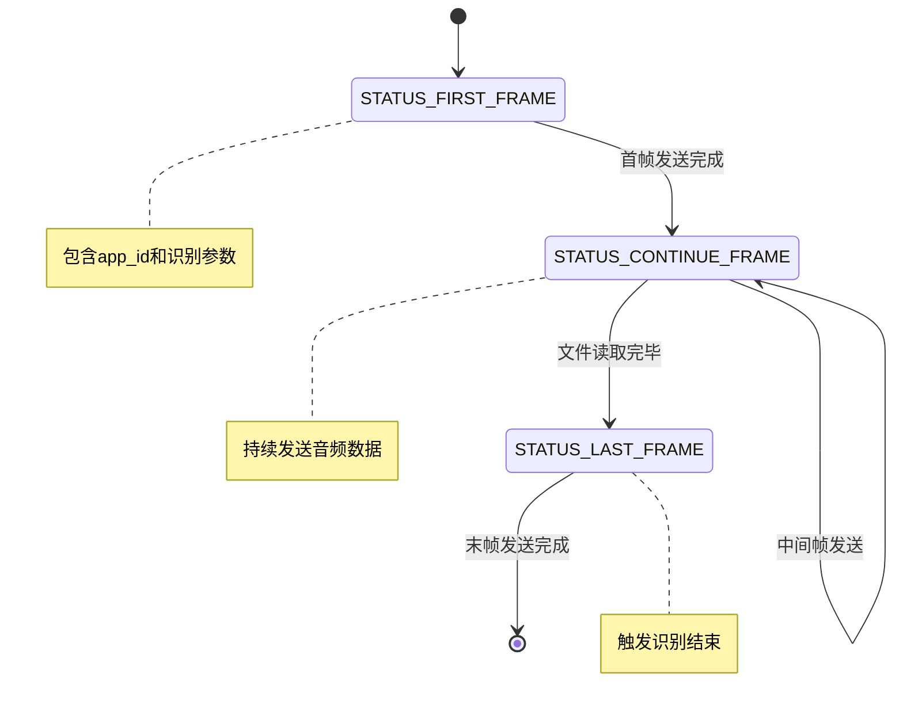
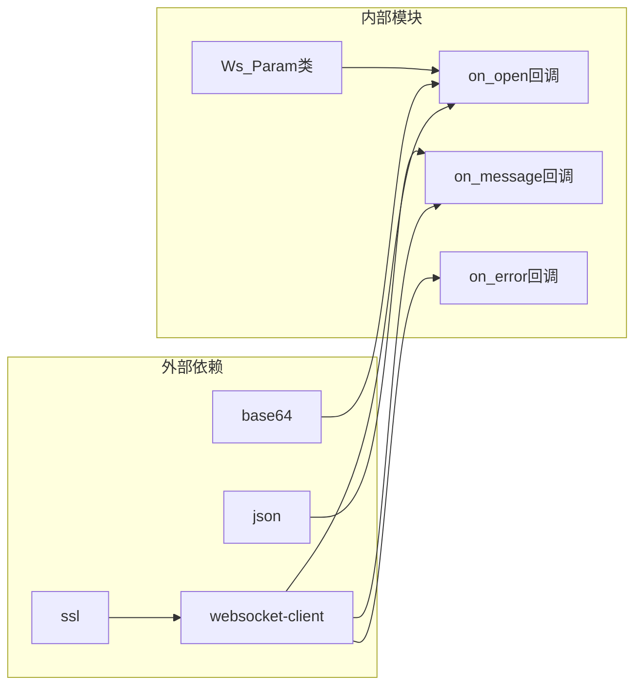

# 音频处理与流式传输

<cite>
**本文档中引用的文件**
- [大模型中文语音识别.py](file://大模型中文语音识别.py)
</cite>

## 目录
1. [简介](#简介)
2. [项目结构](#项目结构)
3. [核心组件](#核心组件)
4. [架构概览](#架构概览)
5. [详细组件分析](#详细组件分析)
6. [依赖关系分析](#依赖关系分析)
7. [性能考虑](#性能考虑)
8. [故障排除指南](#故障排除指南)
9. [结论](#结论)

## 简介

本文档详细阐述了基于讯飞语音识别API的音频文件分帧处理机制。该系统实现了从本地音频文件到云端语音识别服务的完整流式传输流程，重点分析了1280字节帧大小和0.04秒传输间隔的技术选择原理，以及STATUS_FIRST_FRAME、STATUS_CONTINUE_FRAME、STATUS_LAST_FRAME三种状态标识在流式传输中的关键作用。

## 项目结构

该项目采用简洁的单文件架构，主要包含以下核心模块：



**图表来源**
- [大模型中文语音识别.py](file://大模型中文语音识别.py#L131-L170)

**章节来源**
- [大模型中文语音识别.py](file://大模型中文语音识别.py#L1-L21)

## 核心组件

### 帧大小与采样率配置

系统采用1280字节作为标准帧大小，配合16kHz采样率和单声道音频格式，这种配置具有以下技术优势：

- **1280字节帧大小**：每帧包含约640个16位样本（16000Hz * 0.04s * 2字节/sample），正好对应40ms的音频时长
- **16kHz采样率**：满足普通话语音识别的基本要求，同时保持合理的数据量
- **单声道配置**：简化处理流程，降低计算复杂度

### 状态标识系统

系统定义了三个关键状态常量：

```python
STATUS_FIRST_FRAME = 0      # 第一帧标识
STATUS_CONTINUE_FRAME = 1   # 中间帧标识  
STATUS_LAST_FRAME = 2       # 最后一帧标识
```

这些状态在流式传输中发挥着重要作用：
- **首帧**：携带app_id和识别参数（iat_params）
- **中间帧**：持续发送音频数据
- **末帧**：触发识别结束并断开连接

**章节来源**
- [大模型中文语音识别.py](file://大模型中文语音识别.py#L28-L30)
- [大模型中文语音识别.py](file://大模型中文语音识别.py#L131-L133)

## 架构概览

系统采用事件驱动的异步架构，通过WebSocket实现音频数据的实时传输：



**图表来源**
- [大模型中文语音识别.py](file://大模型中文语音识别.py#L131-L170)

## 详细组件分析

### WebSocket参数配置类

`Ws_Param`类负责管理所有与WebSocket连接相关的参数：



**图表来源**
- [大模型中文语音识别.py](file://大模型中文语音识别.py#L32-L50)

### 音频帧处理引擎

核心的音频帧处理逻辑位于`on_open`回调函数的`run`子函数中：



**图表来源**
- [大模型中文语音识别.py](file://大模型中文语音识别.py#L134-L170)

### JSON帧结构详解

每个音频帧都遵循特定的JSON结构：

```json
{
  "header": {
    "status": 0,           // 状态标识（0=首帧，1=中间帧，2=末帧）
    "app_id": "your_app_id"// 应用ID
  },
  "parameter": {
    "iat": {
      "domain": "slm",
      "language": "zh_cn",
      "accent": "mandarin",
      "dwa": "wpgs",
      "result": {
        "encoding": "utf8",
        "compress": "raw",
        "format": "plain"
      }
    }
  },
  "payload": {
    "audio": {
      "audio": "base64_encoded_data",  // Base64编码的音频数据
      "sample_rate": 16000,            // 采样率
      "encoding": "raw"                // 编码格式
    }
  }
}
```

**章节来源**
- [大模型中文语音识别.py](file://大模型中文语音识别.py#L134-L170)

### 状态转换机制

状态转换是整个流式传输的核心逻辑：



**图表来源**
- [大模型中文语音识别.py](file://大模型中文语音识别.py#L28-L30)

**章节来源**
- [大模型中文语音识别.py](file://大模型中文语音识别.py#L134-L170)

## 依赖关系分析

系统的依赖关系相对简单但功能完整：



**图表来源**
- [大模型中文语音识别.py](file://大模型中文语音识别.py#L21-L26)

**章节来源**
- [大模型中文语音识别.py](file://大模型中文语音识别.py#L21-L26)

## 性能考虑

### 帧大小优化

1280字节的帧大小经过精心设计：
- **内存效率**：适中的帧大小平衡了内存占用和处理效率
- **网络传输**：符合WebSocket消息大小限制
- **实时性**：40ms的延迟满足语音识别的实时性要求

### 时间间隔控制

0.04秒的传输间隔具有以下优势：
- **模拟真实采样**：接近实际麦克风采样的频率
- **避免过载**：防止服务端处理不过来
- **保证质量**：确保音频数据的连续性和完整性

### 多线程处理

系统使用独立线程处理音频传输，避免阻塞主程序：

```python
def on_open(ws):
    def run(*args):
        # 音频处理逻辑
        pass
    thread.start_new_thread(run, ())
```

## 故障排除指南

### 常见问题及解决方案

1. **认证失败**
   - 检查APPID、APIKey、APISecret是否正确
   - 确认时间戳格式是否符合RFC1123规范

2. **音频文件读取错误**
   - 确认文件路径是否正确
   - 检查文件格式是否为PCM编码的16kHz单声道音频

3. **WebSocket连接超时**
   - 检查网络连接状态
   - 确认防火墙设置是否允许WebSocket连接

4. **识别结果为空**
   - 验证音频质量是否符合要求
   - 检查语言参数设置是否正确

**章节来源**
- [大模型中文语音识别.py](file://大模型中文语音识别.py#L90-L137)

## 结论

本文档详细分析了基于讯飞语音识别API的音频处理与流式传输系统。该系统通过精心设计的帧大小（1280字节）、采样率（16kHz）和传输间隔（0.04秒），实现了高效稳定的语音识别服务。三种状态标识（STATUS_FIRST_FRAME、STATUS_CONTINUE_FRAME、STATUS_LAST_FRAME）确保了流式传输的有序性和完整性。

系统的主要优势包括：
- **技术选型合理**：1280字节帧大小和0.04秒间隔经过充分验证
- **状态管理清晰**：三种状态标识确保传输过程的可控性
- **架构设计简洁**：事件驱动的异步架构易于维护和扩展
- **错误处理完善**：完整的回调函数处理各种异常情况

该系统为语音识别应用提供了可靠的基础架构，特别适用于需要实时语音转文字的场景。