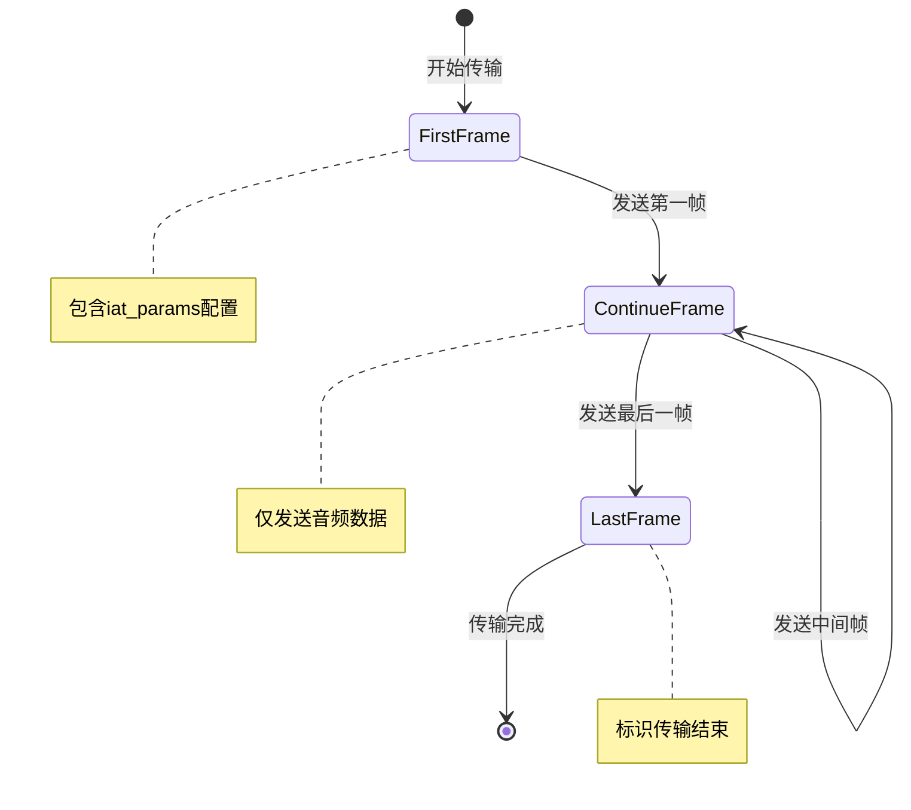

# 配置参数参考文档

<cite>
**本文档中引用的文件**
- [大模型中文语音识别.py](file://大模型中文语音识别.py)
</cite>

## 目录
1. [简介](#简介)
2. [Ws_Param类配置参数](#ws_param类配置参数)
3. [iat_params语音识别配置](#iat_params语音识别配置)
4. [WebSocket连接参数](#websocket连接参数)
5. [音频传输优化参数](#音频传输优化参数)
6. [完整配置参数表](#完整配置参数表)
7. [配置示例](#配置示例)
8. [安全注意事项](#安全注意事项)
9. [故障排除指南](#故障排除指南)

## 简介

本文档详细介绍了基于讯飞语音识别API的Python实现中的所有配置参数。该系统使用WebSocket协议进行实时语音识别，支持多种语言和方言识别，并提供了灵活的配置选项以适应不同的应用场景。

## Ws_Param类配置参数

### 基础认证参数

```python
class Ws_Param(object):
    def __init__(self, APPID, APIKey, APISecret, AudioFile):
        self.APPID = APPID
        self.APIKey = APIKey
        self.APISecret = APISecret
        self.AudioFile = AudioFile
```

#### 参数详解

**APPID** (`string`)
- **类型**: 字符串
- **必需**: 是
- **描述**: 应用程序唯一标识符，用于识别调用方身份
- **来源**: 讯飞开放平台控制台获取
- **安全注意事项**: 绝对不能泄露给第三方，仅在可信环境中使用

**APIKey** (`string`)
- **类型**: 字符串
- **必需**: 是
- **描述**: API访问密钥，用于验证API调用权限
- **来源**: 讯飞开放平台开发者中心获取
- **安全注意事项**: 严格保密，避免硬编码在公共代码库中

**APISecret** (`string`)
- **类型**: 字符串
- **必需**: 是
- **描述**: API密钥签名密钥，用于生成安全签名
- **来源**: 讯飞开放平台开发者中心获取
- **安全注意事项**: 最高优先级的安全敏感信息，必须妥善保管

**AudioFile** (`string`)
- **类型**: 字符串
- **必需**: 是
- **描述**: 待识别的音频文件路径
- **格式要求**: 支持WAV格式音频文件
- **采样率**: 必须为16kHz
- **位深度**: 16位
- **声道**: 单声道

**节来源**
- [大模型中文语音识别.py](file://大模型中文语音识别.py#L44-L58)

## iat_params语音识别配置

`iat_params`字典包含了语音识别的核心配置参数，这些参数直接影响识别准确性和性能。

### 核心识别参数

```python
self.iat_params = {
    "domain": "slm", 
    "language": "zh_cn", 
    "accent": "mandarin",
    "dwa": "wpgs", 
    "result": {
        "encoding": "utf8",
        "compress": "raw",
        "format": "plain"
    }
}
```

#### 参数详解

**domain** (`string`)
- **类型**: 字符串
- **默认值**: `"slm"`
- **可选值**: 
  - `"iat"`: 通用语音识别
  - `"slm"`: 标准汉语识别（默认）
  - `"entertainment"`: 娱乐场景识别
  - `"education"`: 教育场景识别
- **影响**: 决定识别模型的训练领域和适用场景
- **推荐**: 根据实际使用场景选择合适的领域模型

**language** (`string`)
- **类型**: 字符串
- **默认值**: `"zh_cn"`
- **可选值**:
  - `"zh_cn"`: 简体中文（普通话）
  - `"en_us"`: 英语
  - `"yue"`: 粤语
  - `"wuu"`: 吴语
  - `"ja"`: 日语
  - `"ko"`: 韩语
- **影响**: 影响词汇表和语法模型的选择
- **方言支持**: 通过讯飞开放平台设置个性化热词来增强方言识别能力

**accent** (`string`)
- **类型**: 字符串
- **默认值**: `"mandarin"`
- **可选值**:
  - `"mandarin"`: 普通话
  - `"cantonese"`: 粤语
  - `"shanghainese"`: 上海话
  - `"chinese"`: 通用中文
- **影响**: 影响声学模型和发音规则
- **方言识别**: 对于特定方言，建议在控制台设置个性化热词

**dwa** (`string`)
- **类型**: 字符串
- **默认值**: `"wpgs"`
- **可选值**:
  - `"wpgs"`: 动态修正（默认）
  - `"disable"`: 禁用动态修正
- **影响**: 控制识别过程中的动态修正功能
- **性能**: 启用动态修正会略微增加延迟但提高准确性

### 结果输出配置

**result.encoding** (`string`)
- **类型**: 字符串
- **默认值**: `"utf8"`
- **可选值**:
  - `"utf8"`: UTF-8编码（默认）
  - `"gbk"`: GBK编码
- **影响**: 输出文本的字符编码格式
- **推荐**: 通常使用UTF-8以确保兼容性

**result.compress** (`string`)
- **类型**: 字符串
- **默认值**: `"raw"`
- **可选值**:
  - `"raw"`: 原始数据（默认）
  - `"gzip"`: GZIP压缩
- **影响**: 数据传输压缩方式
- **性能**: 启用压缩可以减少网络传输量

**result.format** (`string`)
- **类型**: 字符串
- **默认值**: `"plain"`
- **可选值**:
  - `"plain"`: 纯文本格式（默认）
  - `"xml"`: XML格式
  - `"json"`: JSON格式
- **影响**: 识别结果的数据格式
- **推荐**: 根据后续处理需求选择合适格式

**节来源**
- [大模型中文语音识别.py](file://大模型中文语音识别.py#L51-L58)

## WebSocket连接参数

### 固定参数

系统使用固定的WebSocket连接参数以确保兼容性和稳定性：

```python
url = 'ws://iat.xf-yun.com/v1'
```

#### 服务器地址参数

**服务器地址**: `ws://iat.xf-yun.com/v1`
- **协议**: WebSocket (ws://)
- **端点**: `/v1`
- **域名**: `iat.xf-yun.com`
- **安全性**: 使用HTTP协议，不支持HTTPS

### 鉴权参数

```python
v = {
    "authorization": authorization,
    "date": date,
    "host": "iat.xf-yun.com"
}
```

#### 鉴权机制

**authorization** (`string`)
- **类型**: Base64编码字符串
- **生成方式**: HMAC-SHA256签名
- **算法**: `hmac-sha256`
- **头部**: `host date request-line`

**date** (`string`)
- **类型**: RFC1123格式时间戳
- **格式**: `EEE, dd MMM yyyy HH:mm:ss GMT`
- **用途**: 请求时间验证

**host** (`string`)
- **类型**: 字符串
- **值**: `iat.xf-yun.com`
- **用途**: 主机验证

**节来源**
- [大模型中文语音识别.py](file://大模型中文语音识别.py#L67-L89)

## 音频传输优化参数

### 帧大小和采样参数

```python
frameSize = 1280  # 每一帧的音频大小
intervel = 0.04   # 发送音频间隔(单位:s)
sample_rate = 16000  # 采样率
encoding = "raw"     # 编码格式
```

#### 关键参数详解

**frameSize** (`integer`)
- **默认值**: `1280`字节
- **范围**: 128-4096字节
- **影响**: 
  - 较小值: 更低延迟，更高CPU使用率
  - 较大值: 更高效率，可能增加延迟
- **推荐**: 根据网络状况调整，通常1280字节为最佳平衡点

**intervel** (`float`)
- **默认值**: `0.04`秒（40毫秒）
- **范围**: 0.01-0.1秒
- **影响**:
  - 较小值: 实时性更好，带宽占用更高
  - 较大值: 带宽节省，可能影响实时性
- **推荐**: 40毫秒为标准采样间隔

**sample_rate** (`integer`)
- **默认值**: `16000`赫兹
- **标准值**: 16kHz（电话质量）
- **可选值**: 8kHz, 16kHz, 32kHz
- **影响**: 音质和计算复杂度
- **限制**: 必须与音频文件采样率匹配

**encoding** (`string`)
- **默认值**: `"raw"`
- **可选值**:
  - `"raw"`: 原始PCM数据（默认）
  - `"speex"`: Speex编码
  - `"aac"`: AAC编码
- **影响**: 数据压缩和传输效率
- **推荐**: 原始格式以获得最佳质量

### 传输状态管理

```python
STATUS_FIRST_FRAME = 0      # 第一帧标识
STATUS_CONTINUE_FRAME = 1   # 中间帧标识
STATUS_LAST_FRAME = 2       # 最后一帧标识
```

#### 状态转换流程



**图表来源**
- [大模型中文语音识别.py](file://大模型中文语音识别.py#L34-L36)

**节来源**
- [大模型中文语音识别.py](file://大模型中文语音识别.py#L131-L132)
- [大模型中文语音识别.py](file://大模型中文语音识别.py#L158-L188)

## 完整配置参数表

| 参数组 | 参数名 | 类型 | 默认值 | 描述 | 示例 |
|--------|--------|------|--------|------|------|
| **基础认证** | APPID | string | - | 应用程序ID | "your_app_id" |
| | APIKey | string | - | API密钥 | "your_api_key" |
| | APISecret | string | - | API密钥签名密钥 | "your_api_secret" |
| | AudioFile | string | - | 音频文件路径 | "./audio.wav" |
| **语音识别** | domain | string | "slm" | 领域模型 | "iat", "slm", "education" |
| | language | string | "zh_cn" | 语言代码 | "zh_cn", "en_us", "yue" |
| | accent | string | "mandarin" | 口音类型 | "mandarin", "cantonese" |
| | dwa | string | "wpgs" | 动态修正 | "wpgs", "disable" |
| **结果格式** | encoding | string | "utf8" | 字符编码 | "utf8", "gbk" |
| | compress | string | "raw" | 压缩方式 | "raw", "gzip" |
| | format | string | "plain" | 输出格式 | "plain", "json", "xml" |
| **WebSocket** | host | string | "iat.xf-yun.com" | 服务器主机 | "iat.xf-yun.com" |
| | port | integer | 80 | 服务器端口 | 80 |
| **音频传输** | frameSize | integer | 1280 | 帧大小(字节) | 1280 |
| | intervel | float | 0.04 | 发送间隔(秒) | 0.04 |
| | sample_rate | integer | 16000 | 采样率(Hz) | 16000 |
| | encoding | string | "raw" | 音频编码 | "raw", "speex" |

## 配置示例

### 基础普通话识别配置

```python
wsParam = Ws_Param(
    APPID="your_app_id",
    APIKey="your_api_key",
    APISecret="your_api_secret",
    AudioFile="./speech.wav"
)
```

### 方言识别配置

```python
wsParam = Ws_Param(
    APPID="your_app_id",
    APIKey="your_api_key",
    APISecret="your_api_secret",
    AudioFile="./cantonese_speech.wav"
)

# 修改方言配置
wsParam.iat_params.update({
    "language": "yue",           # 粤语
    "accent": "cantonese",       # 粤语口音
    "domain": "slm"              # 标准汉语模型
})
```

### 专业领域识别配置

```python
wsParam = Ws_Param(
    APPID="your_app_id",
    APIKey="your_api_key",
    APISecret="your_api_secret",
    AudioFile="./medical_audio.wav"
)

# 医疗领域配置
wsParam.iat_params.update({
    "domain": "education",       # 教育场景（可替换为医疗领域）
    "language": "zh_cn",         # 简体中文
    "dwa": "wpgs",              # 启用动态修正
    "result": {
        "encoding": "utf8",
        "compress": "raw",
        "format": "plain"
    }
})
```

### 高实时性配置

```python
wsParam = Ws_Param(
    APPID="your_app_id",
    APIKey="your_api_key",
    APISecret="your_api_secret",
    AudioFile="./realtime_audio.wav"
)

# 调整传输参数以获得更低延迟
frameSize = 640     # 减少帧大小
intervel = 0.02     # 减少发送间隔
```

### 高质量配置

```python
wsParam = Ws_Param(
    APPID="your_app_id",
    APIKey="your_api_key",
    APISecret="your_api_secret",
    AudioFile="./high_quality_audio.wav"
)

# 提升音质配置
wsParam.iat_params.update({
    "sample_rate": 32000,       # 提高采样率
    "encoding": "aac",          # 使用AAC编码
    "result": {
        "format": "json",       # 使用JSON格式便于解析
        "compress": "gzip"      # 启用压缩
    }
})
```

## 安全注意事项

### 敏感信息保护

1. **API密钥管理**
   - 绝对不要将API密钥硬编码在源代码中
   - 使用环境变量存储敏感信息
   - 定期轮换API密钥
   - 限制API密钥的使用范围和权限

2. **网络传输安全**
   - 当前实现使用HTTP协议，存在被窃听风险
   - 建议部署时启用HTTPS/TLS加密
   - 在可信网络环境中使用

3. **文件访问控制**
   - 确保音频文件权限设置正确
   - 避免在公共目录中存放敏感音频文件
   - 定期清理临时音频文件

### 配置验证

```python
def validate_config(wsParam):
    """验证配置参数的有效性"""
    errors = []
    
    # 检查必填参数
    required_params = ['APPID', 'APIKey', 'APISecret', 'AudioFile']
    for param in required_params:
        if not getattr(wsParam, param):
            errors.append(f"缺少必要参数: {param}")
    
    # 检查音频文件存在性
    import os
    if not os.path.exists(wsParam.AudioFile):
        errors.append(f"音频文件不存在: {wsParam.AudioFile}")
    
    # 检查采样率
    try:
        import wave
        with wave.open(wsParam.AudioFile, 'r') as wav_file:
            if wav_file.getframerate() != 16000:
                errors.append("音频采样率必须为16kHz")
    except Exception as e:
        errors.append(f"无法读取音频文件: {str(e)}")
    
    return errors
```

## 故障排除指南

### 常见问题及解决方案

#### 1. 认证失败错误

**错误现象**: `请求错误：xxxx`
**可能原因**:
- APPID、APIKey或APISecret错误
- 时间同步问题
- 签名生成错误

**解决方案**:
```python
# 检查时间同步
import datetime
now = datetime.datetime.now()
print(f"当前时间: {now}")

# 验证签名生成逻辑
signature_origin = "host: iat.xf-yun.com\n"
signature_origin += f"date: {date}\n"
signature_origin += "GET /v1 HTTP/1.1"
print(f"签名原文: {signature_origin}")
```

#### 2. 音频格式错误

**错误现象**: 识别结果为空或错误
**可能原因**:
- 音频文件格式不支持
- 采样率不是16kHz
- 音频文件损坏

**解决方案**:
```python
import wave

def validate_audio_file(file_path):
    """验证音频文件格式"""
    try:
        with wave.open(file_path, 'r') as wav_file:
            params = wav_file.getparams()
            print(f"采样率: {params.framerate}Hz")
            print(f"位深度: {params.sampwidth * 8}位")
            print(f"声道数: {params.nchannels}")
            print(f"总帧数: {params.nframes}")
            
            if params.framerate != 16000:
                print("警告: 推荐使用16kHz采样率")
            if params.nchannels != 1:
                print("警告: 推荐使用单声道音频")
                
    except Exception as e:
        print(f"音频文件验证失败: {e}")
```

#### 3. 网络连接问题

**错误现象**: WebSocket连接超时或失败
**可能原因**:
- 网络防火墙阻止
- DNS解析问题
- 服务器不可达

**解决方案**:
```python
import socket

def test_connection():
    """测试网络连接"""
    try:
        # 测试DNS解析
        ip = socket.gethostbyname('iat.xf-yun.com')
        print(f"DNS解析成功: iat.xf-yun.com -> {ip}")
        
        # 测试端口连通性
        sock = socket.socket(socket.AF_INET, socket.SOCK_STREAM)
        sock.settimeout(5)
        result = sock.connect_ex(('iat.xf-yun.com', 80))
        if result == 0:
            print("端口连通性测试: 成功")
        else:
            print(f"端口连通性测试: 失败, 错误码: {result}")
        sock.close()
        
    except Exception as e:
        print(f"网络连接测试失败: {e}")
```

#### 4. 性能优化建议

**延迟优化**:
- 减少frameSize到640字节
- 降低intervel到0.02秒
- 使用更高效的音频编码格式

**吞吐量优化**:
- 增加frameSize到2048字节
- 增大intervel到0.06秒
- 启用gzip压缩

**内存优化**:
- 使用流式处理大文件
- 及时释放音频缓冲区
- 监控内存使用情况

### 调试工具

```python
def enable_debug_mode():
    """启用调试模式"""
    import logging
    logging.basicConfig(level=logging.DEBUG)
    
    # 启用WebSocket跟踪
    websocket.enableTrace(True)
    
    # 打印详细的URL生成过程
    print(f"生成的URL: {wsUrl}")
    
    # 打印完整的请求载荷
    print(f"第一帧载荷: {json.dumps(first_frame_payload, indent=2, ensure_ascii=False)}")

def monitor_performance():
    """监控性能指标"""
    import psutil
    import time
    
    start_time = time.time()
    cpu_percent = psutil.cpu_percent(interval=1)
    memory_usage = psutil.virtual_memory().percent
    
    print(f"CPU使用率: {cpu_percent}%")
    print(f"内存使用率: {memory_usage}%")
    print(f"运行时间: {time.time() - start_time:.2f}秒")
```

通过遵循本文档中的配置指南和最佳实践，您可以充分利用讯飞语音识别API的强大功能，同时确保系统的安全性和稳定性。定期检查更新和维护配置参数，以适应不断变化的应用需求和技术发展。