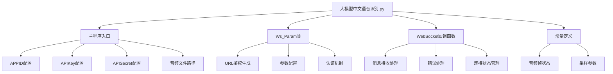
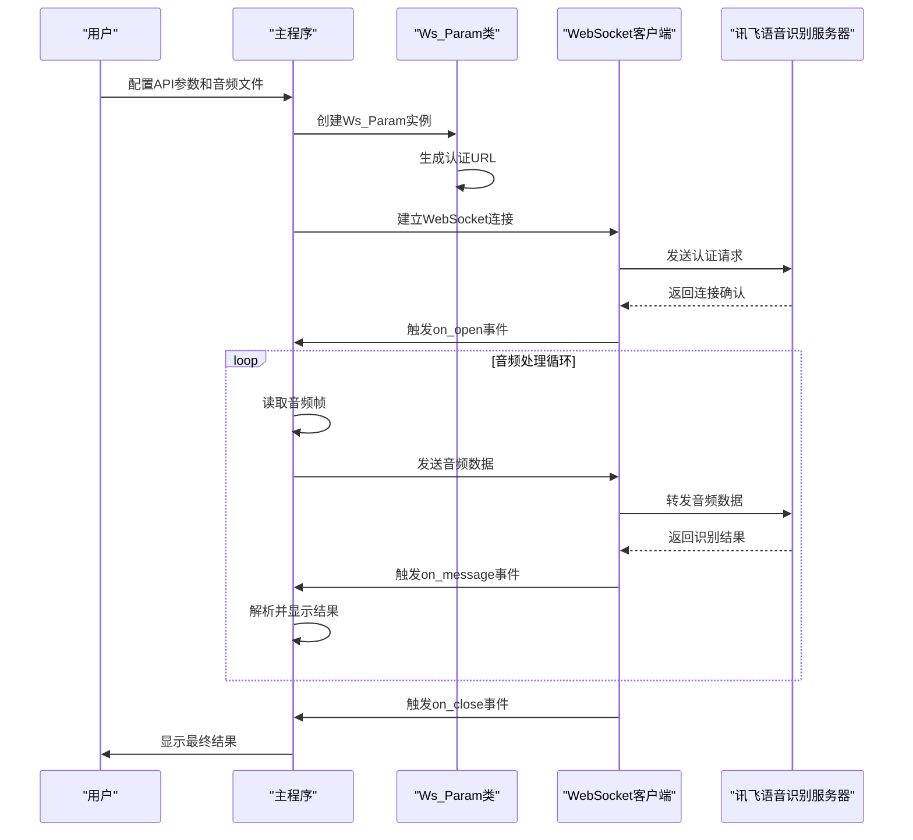
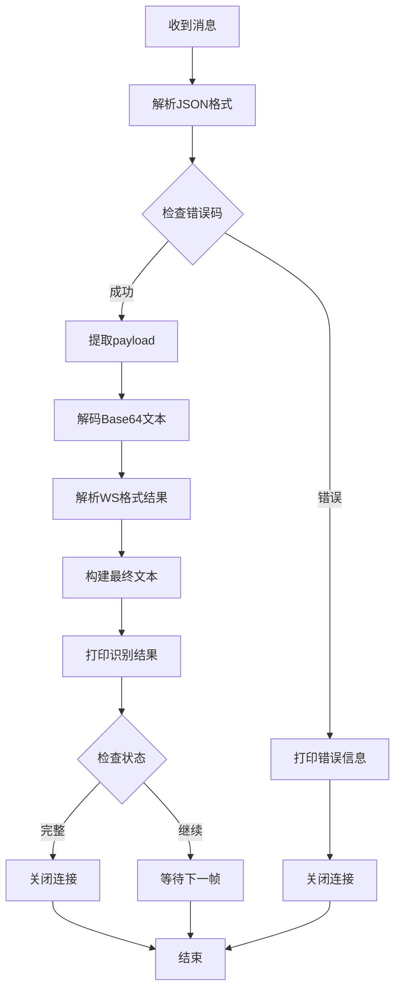
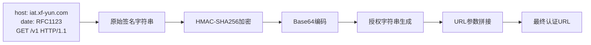
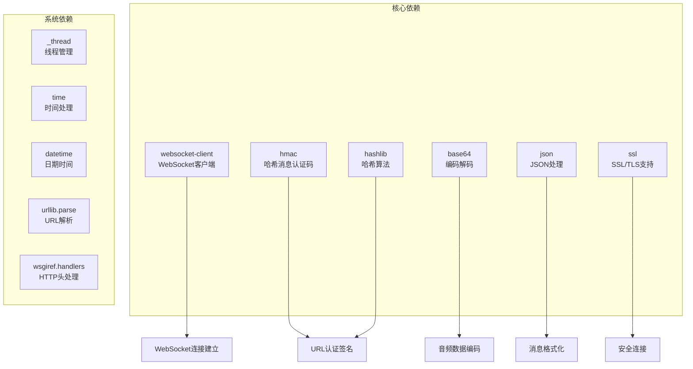
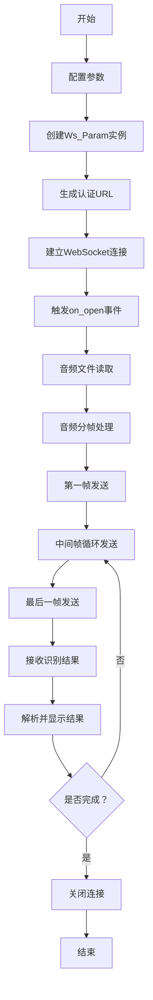

# 讯飞语音识别客户端项目概述

<cite>
**本文档中引用的文件**
- [大模型中文语音识别.py](file://大模型中文语音识别.py)
</cite>

## 目录
1. [项目简介](#项目简介)
2. [项目结构](#项目结构)
3. [核心组件](#核心组件)
4. [架构概览](#架构概览)
5. [详细组件分析](#详细组件分析)
6. [技术栈分析](#技术栈分析)
7. [工作流程](#工作流程)
8. [性能考虑](#性能考虑)
9. [故障排除指南](#故障排除指南)
10. [结论](#结论)

## 项目简介

本项目是一个基于讯飞开放平台流式WebAPI实现的中文语音识别客户端，专为Python开发者设计。该项目提供了一个简洁明了、可复用的示例程序，用于快速集成讯飞语音听写服务。

### 项目目标

- **简化集成**：为开发者提供开箱即用的语音识别解决方案
- **实时处理**：支持流式音频传输和实时识别结果输出
- **易于扩展**：采用模块化设计，便于功能扩展和定制
- **学习友好**：代码结构清晰，适合初学者理解和学习

### 目标用户

- 希望快速上手讯飞语音识别API的Python开发者
- 需要集成语音识别功能的应用程序开发人员
- 对流式语音识别技术感兴趣的开发者
- 学习语音处理和WebSocket通信的程序员

## 项目结构

本项目采用单文件设计，所有功能集中在一个Python脚本中，体现了简洁性和可维护性。



**图表来源**
- [大模型中文语音识别.py](file://大模型中文语音识别.py#L44-L91)

**章节来源**
- [大模型中文语音识别.py](file://大模型中文语音识别.py#L1-L212)

## 核心组件

### Ws_Param类 - WebSocket参数管理器

`Ws_Param`类是整个项目的核心组件，负责管理WebSocket连接所需的所有参数和认证信息。

```python
class Ws_Param(object):
    def __init__(self, APPID, APIKey, APISecret, AudioFile):
        self.APPID = APPID
        self.APIKey = APIKey
        self.APISecret = APISecret
        self.AudioFile = AudioFile
        self.iat_params = {
            "domain": "slm", 
            "language": "zh_cn", 
            "accent": "mandarin",
            "dwa": "wpgs", 
            "result": {
                "encoding": "utf8",
                "compress": "raw",
                "format": "plain"
            }
        }
```

该类的主要职责：
- **身份验证**：存储和管理API密钥、应用ID等认证信息
- **参数配置**：设置语音识别的语言、领域、编码等参数
- **URL生成**：根据认证信息生成符合讯飞API规范的WebSocket URL
- **状态管理**：维护音频处理的状态信息

### 状态常量系统

项目定义了三个关键的状态常量来管理音频帧的处理流程：

```python
STATUS_FIRST_FRAME = 0  # 第一帧的标识
STATUS_CONTINUE_FRAME = 1  # 中间帧标识
STATUS_LAST_FRAME = 2  # 最后一帧的标识
```

这些状态常量确保音频数据能够按照正确的顺序进行处理和传输。

**章节来源**
- [大模型中文语音识别.py](file://大模型中文语音识别.py#L44-L91)
- [大模型中文语音识别.py](file://大模型中文语音识别.py#L39-L42)

## 架构概览

本项目采用了事件驱动的单文件架构，结合了面向对象编程和函数式编程的特点。



**图表来源**
- [大模型中文语音识别.py](file://大模型中文语音识别.py#L199-L211)
- [大模型中文语音识别.py](file://大模型中文语音识别.py#L129-L197)

### 架构特点

1. **事件驱动设计**：基于WebSocket的异步通信模式
2. **模块化组织**：清晰的功能分离和职责划分
3. **实时处理**：支持流式音频数据的实时处理
4. **错误处理**：完善的异常捕获和错误恢复机制

## 详细组件分析

### WebSocket回调函数系统

项目实现了完整的WebSocket回调函数集，每个函数都有明确的职责：

#### on_message函数 - 消息处理核心



**图表来源**
- [大模型中文语音识别.py](file://大模型中文语音识别.py#L95-L115)

#### on_open函数 - 连接建立处理

on_open函数是最复杂的部分，负责音频数据的分帧处理和实时发送：

```python
def on_open(ws):
    def run(*args):
        frameSize = 1280  # 每一帧的音频大小
        intervel = 0.04  # 发送音频间隔(单位:s)
        status = STATUS_FIRST_FRAME  # 音频的状态信息
        
        with open(wsParam.AudioFile, "rb") as fp:
            while True:
                buf = fp.read(frameSize)
                audio = str(base64.b64encode(buf), 'utf-8')
                
                # 根据状态发送不同类型的帧
                if status == STATUS_FIRST_FRAME:
                    # 发送第一帧数据
                elif status == STATUS_CONTINUE_FRAME:
                    # 发送中间帧数据
                elif status == STATUS_LAST_FRAME:
                    # 发送最后一帧并结束
                
                time.sleep(intervel)
```

该函数实现了：
- **音频分帧**：将音频文件分割成固定大小的数据块
- **状态管理**：跟踪当前处理的是第一帧、中间帧还是最后一帧
- **实时发送**：按照指定的时间间隔发送音频数据
- **线程隔离**：使用多线程避免阻塞主线程

#### 其他回调函数

- **on_error**：处理WebSocket连接过程中的错误
- **on_close**：管理连接关闭后的清理工作

**章节来源**
- [大模型中文语音识别.py](file://大模型中文语音识别.py#L95-L125)
- [大模型中文语音识别.py](file://大模型中文语音识别.py#L129-L197)

### URL认证机制

项目实现了符合讯飞API规范的URL认证机制：



**图表来源**
- [大模型中文语音识别.py](file://大模型中文语音识别.py#L61-L91)

认证过程包括：
1. **时间戳生成**：使用RFC1123格式的标准时间
2. **签名字符串构建**：包含主机、日期和请求行信息
3. **HMAC-SHA256加密**：使用API密钥进行安全加密
4. **Base64编码**：将加密结果转换为标准格式
5. **URL参数组装**：将认证信息嵌入WebSocket URL

**章节来源**
- [大模型中文语音识别.py](file://大模型中文语音识别.py#L61-L91)

## 技术栈分析

### 核心依赖库

项目使用了以下关键依赖库：



**图表来源**
- [大模型中文语音识别.py](file://大模型中文语音识别.py#L27-L34)

### 关键技术组件

1. **websocket-client**：提供WebSocket协议的完整实现
2. **hmac + hashlib**：实现安全的认证机制
3. **base64**：处理二进制音频数据的编码转换
4. **多线程支持**：确保音频发送不会阻塞主程序

### 版本兼容性

项目明确指定了Python 3.7的运行环境，确保了与讯飞API的兼容性。

**章节来源**
- [大模型中文语音识别.py](file://大模型中文语音识别.py#L1-L21)

## 工作流程

### 整体工作流



**图表来源**
- [大模型中文语音识别.py](file://大模型中文语音识别.py#L199-L211)
- [大模型中文语音识别.py](file://大模型中文语音识别.py#L129-L197)

### 音频处理流程

音频数据的处理遵循严格的时序要求：

1. **第一帧发送**：包含完整的参数配置和初始音频数据
2. **中间帧发送**：持续传输音频数据，不包含重复的参数
3. **最后一帧发送**：标记音频结束并触发最终识别

### 结果解析流程


**图表来源**
- [大模型中文语音识别.py](file://大模型中文语音识别.py#L95-L115)

**章节来源**
- [大模型中文语音识别.py](file://大模型中文语音识别.py#L199-L211)
- [大模型中文语音识别.py](file://大模型中文语音识别.py#L129-L197)

## 性能考虑

### 音频采样优化

- **帧大小**：每帧1280字节，平衡内存使用和网络效率
- **采样间隔**：0.04秒间隔，模拟真实音频采样频率
- **实时性**：通过多线程实现非阻塞的音频发送

### 内存管理

- **流式读取**：使用文件指针逐块读取音频文件，避免大文件占用过多内存
- **及时释放**：音频处理完成后立即释放相关资源

### 网络优化

- **连接复用**：单次连接完成整个识别过程
- **压缩传输**：使用Base64编码减少传输体积
- **错误重试**：完善的错误处理机制确保连接稳定性

## 故障排除指南

### 常见问题及解决方案

#### 认证失败

**症状**：收到错误码提示认证失败
**原因**：API密钥、应用ID或时间戳配置错误
**解决**：
1. 检查APPID、APIKey、APISecret是否正确
2. 确认系统时间与服务器时间同步
3. 验证音频文件路径是否有效

#### 连接超时

**症状**：WebSocket连接无法建立
**原因**：网络问题或防火墙阻止
**解决**：
1. 检查网络连接状态
2. 确认防火墙设置允许WebSocket连接
3. 使用代理服务器（如需要）

#### 音频格式错误

**症状**：识别结果为空或错误
**原因**：音频文件格式不符合要求
**解决**：
1. 确保音频文件为PCM格式
2. 采样率为16kHz
3. 单声道音频
4. 文件大小适中

### 调试技巧

1. **启用调试模式**：将`websocket.enableTrace(True)`取消注释
2. **检查URL生成**：对比打印的URL与预期结果
3. **监控网络流量**：使用网络抓包工具分析通信过程
4. **日志记录**：在关键位置添加日志输出

**章节来源**
- [大模型中文语音识别.py](file://大模型中文语音识别.py#L95-L125)

## 结论

本项目成功地实现了一个功能完整、结构清晰的讯飞语音识别客户端。通过单文件设计和事件驱动架构，它为Python开发者提供了一个优秀的学习和参考模板。

### 主要优势

1. **简洁性**：单文件设计降低了学习和部署的复杂度
2. **完整性**：涵盖了从认证到结果解析的完整流程
3. **可扩展性**：模块化设计便于功能扩展和定制
4. **教育价值**：代码结构清晰，适合学习和理解

### 应用场景

- **原型开发**：快速验证语音识别功能
- **教育培训**：作为语音处理技术的学习案例
- **小型应用**：满足基本的语音识别需求
- **技术研究**：作为语音识别技术的研究基础

### 发展建议

1. **功能增强**：添加更多语音识别参数配置选项
2. **错误处理**：完善异常处理和重试机制
3. **性能优化**：优化音频处理和网络传输效率
4. **文档完善**：提供更详细的使用说明和示例

该项目为开发者提供了一个良好的起点，展示了如何有效地集成讯飞语音识别服务，同时也为后续的功能扩展和技术改进奠定了坚实的基础。